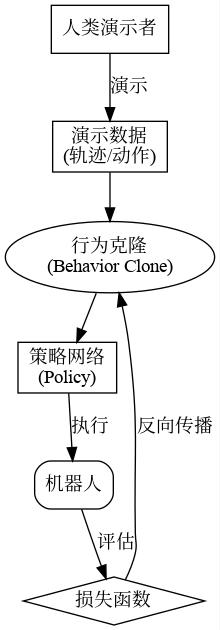

# 01-3 具身智能概述

> **前置课程**：01-2 机器人系统组成
> **后续课程**：02-1 空间描述与变换

**作者**：霍海杰 | **联系方式**：howe12@126.com

---

> **前置说明**：上一节我们认识了机器人的四大系统——机械结构、驱动系统、感知系统和控制系统。这些是机器人的"身体"。但你有沒有想过一个问题——一个拥有这些部件的机器人，是否就拥有了"智能"？一个能精准重复动作的机械臂，和一个能够自主决策、灵活应对新环境的机器人，它们之间的本质区别是什么？答案就藏在我们今天要讲的主题里——**具身智能**。从本节课开始，我们将深入探讨人工智能与机器人结合的前沿领域，看看"智能"如何真正走进物理世界。

想象一下：你对Siri说"帮我倒杯水"，它能回答"好的"——但它能动吗？不能。你对ChatGPT说"帮我倒杯水"，它能帮你查询倒水的方法——但它能动吗？也不能。它们都很"智能"，但它们都只存在于数字世界里。

但如果你对一个人形机器人说同样的话，它真的能跑去厨房、拿起水壶、倒出水来——这才是真正的"智能+"身体"的结合。这就是具身智能的魅力所在。

---

## 1. 什么是具身智能？

### 1.1 从"缸中之脑"说起

在深入了解具身智能之前，让我们先做一个有趣的思想实验。

想象一下，有一个被切掉头颅的人脑，被浸泡在一个充满营养液的缸中，脑的神经末梢连接到一台超级计算机。这台计算机模拟真实世界的一切信息，不断向大脑发送信号，让它"看到"天空、"听到"鸟鸣、"感受到"微风。在这个设定里，这个"缸中之脑"会认为自己正生活在一个真实的世界里——它会思考、会恐惧、会快乐，却唯独没有真正"活"过。

*图注："缸中之脑"——一个经典的哲学思想实验，探讨什么是"真实"的体验*

这不仅是哲学家的话题，也是人工智能领域的一个核心隐喻。

今天我们熟悉的AI，比如ChatGPT、Midjourney，它们在数字世界里"思考"和"创作"，但它们从未真正"活"过——它们没有身体，不知道什么是疼痛，不理解重力意味着什么，不懂得为什么要小心轻放一个杯子。它们是数字世界的"缸中之脑"。

而**具身智能（Embodied AI）**，正是要打破这个困境。

### 1.2 具身智能的核心定义

那么，到底什么是具身智能？

> **具身智能**指的是能够通过物理身体（如机器人、自动驾驶汽车、无人机等）在真实世界中进行感知、交互和学习的智能系统。它强调智能体必须拥有一个"身体"，并通过这个身体与环境互动，从而获得对世界更深层次、更符合物理规律的理解。

简单来说，我们可以用一个简洁的公式来概括：

**具身智能 = 智能的大脑 + 行动的身体**

*图注：具身智能 = 智能的大脑 + 行动的身体*

这个定义看似简单，实则包含了一场深刻的技术和哲学革命。它意味着：

- AI不再只是运行在服务器上的算法，而是能够"落地"到物理世界
- 智能不再只是处理文本和图片，而是能够理解三维空间、力学、因果关系
- 学习不再只是从大数据中统计规律，而是通过与真实环境的交互来"体验"和"试错"

### 1.3 三要素：身体、大脑与环境

理解具身智能，关键在于理解它的三个核心要素。这三个要素缺一不可，共同构成了具身智能的完整形态。

| 要素 | 说明 | 类比人体 | 机器人实例 |
|------|------|----------|------------|
| **身体（Body）** | 智能体的物理形态，包括传感器和执行器 | 手、脚、皮肤 | 机械臂、摄像头、轮子 |
| **大脑（Brain）** | 智能算法核心，负责感知理解、决策规划、学习推理 | 大脑 | 深度学习、RL、大模型 |
| **环境（Environment）** | 智能体所处的物理世界，是学习和实践的舞台 | 周围的世界 | 教室、工厂、火星表面 |

*图注：具身智能的三要素——身体、大脑与环境*

**为什么这三个要素缺一不可？**

让我们用一个生活化的例子来说明：

想象一个婴儿学习"抓握"这个动作。对于成年人来说，这简直是小菜一碟，但对于婴儿来说，这是一个极其复杂的学习过程。婴儿需要：

1. **身体**——拥有一双能张开握紧的小手
2. **大脑**——理解"手"和"物体"的关系，知道伸手就能抓到东西
3. **环境**——有东西可以抓，并且抓到了会有"满足感"

更重要的是，这个学习过程是**具身**的——婴儿不是看着说明书学会抓握的，而是在一次又一次的尝试中，通过手与物体的接触、力度的感知、成功的喜悦，逐渐掌握了这个技能。

具身智能的核心理念正是如此：**真正的智能是在与环境的持续互动和反馈中涌现的，而非凭空产生的。**

### 1.4 非具身AI vs 具身智能

为了更好地理解具身智能，让我们将它与传统的非具身AI进行对比。

| 特点 | 非具身AI | 具身智能 |
|------|----------|----------|
| **存在形式** | 数字世界（服务器、云端） | 物理世界（机器人、车辆） |
| **交互方式** | 文本、图像、视频 | 感知-决策-执行闭环 |
| **学习方式** | 互联网大数据训练 | 与环境交互试错 |
| **理解维度** | 二维信息（像素、token） | 三维空间+时间+物理规律 |
| **典型代表** | ChatGPT、Midjourney | 波士顿动力Atlas、特斯拉Optimus |
| **优势领域** | 文本生成、图像识别、语言对话 | 灵活操作、导航、实时决策 |
| **核心挑战** | 幻觉、推理深度 | Sim-to-Real、数据稀缺 |

*图注：非具身AI与具身智能的对比——一个是数字世界的大脑，一个是物理世界的行动者*

**一个生动的比喻：**

- 非具身AI就像一个从未下过棋但熟读所有棋谱的"理论大师"
- 具身智能就像一个在棋盘上真刀真枪历练的"实战选手"

两者都很重要，但只有"实战选手"才能真正应对复杂多变的现实世界。

---

## 2. 具身智能的发展历程

具身智能并非一蹴而就的概念，它的发展历程波澜壮阔，是一部机器人与人工智能技术交织演进的奋斗史。让我们沿着时间线，一同回顾这段激动人心的旅程。

### 2.1 萌芽期：从理论到实践（1966-1972）

**一切都始于一个问题：机器能"思考"吗？**

1956年，在达特茅斯会议上，"人工智能"这个术语首次被正式提出。此后，科学家们开始畅想：机器能否像人一样智能地行动？

1966年，一个划时代的项目在斯坦福研究院（SRI International）正式启动。经过数年的研发，1972年，世界上第一台真正意义上的移动机器人**Shakey**诞生了。

*图注：Shakey机器人——世界上第一台能够感知环境、制定计划并执行任务的移动机器人*

**Shakey的划时代意义：**

- **首次整合感知、推理、行动**：在此之前，机器人的感知、决策和执行通常是分离的。Shakey首次将这三个环节整合在一起，形成了一个完整的"感知-规划-行动"闭环。
- **视觉感知**：Shakey配备了摄像头和早期的视觉处理算法，能够"看到"周围的环境。
- **规划能力**：它能够根据看到的信息制定简单的行动计划，比如绕开障碍物到达目标位置。

尽管以今天的标准来看，Shakey的反应速度慢得可怜（完成一个简单任务可能需要好几个小时），但它开创了一个全新的时代——机器人开始从"自动化工具"向"智能体"进化。

> **历史小知识**：Shakey的名字来源于它的特性——由于早期传感器精度有限，机器人在移动时会不停摇晃（shake），因此研究人员幽默地给它取了这个名字。

### 2.2 发展期：运动控制的突破（2000-2020）

进入21世纪，具身智能迎来了飞速发展期。这一阶段的关键词是：**深度学习**和**运动控制**。

**深度学习赋能计算机视觉**

2012年，AlexNet在ImageNet图像分类竞赛中一鸣惊人，深度学习开始在计算机视觉领域大放异彩。研究者们惊喜地发现，通过深度神经网络，机器可以"学会"识别图像中的物体、理解场景信息。

这对于具身智能意味着什么？机器人终于拥有了更敏锐的"眼睛"。

**强化学习："试错"中学习**

除了视觉，另一个重大突破是强化学习（Reinforcement Learning, RL）的成熟。

传统的机器人控制需要人类工程师预先编写详细的运动规则——"如果遇到障碍物，就向左转15度"。但现实世界太复杂了，不可能为每种情况都编写规则。

强化学习提供了一种全新的范式：让机器人在模拟器或真实环境中"试错"。做对了就奖励，做错了就惩罚。通过成千上万次的尝试，机器人能自动学会复杂的技能，比如平衡行走、灵活抓取。

**波士顿动力：运动的艺术**

这一时期，波士顿动力公司成为万众瞩目的焦点。

*图注：波士顿动力家族——从BigDog到Atlas，展现了运动控制的巅峰之作*

- **BigDog（2005）**：一款能够负重行走、四足跳跃的仿生机器人，即使在崎岖地形也能保持稳定。它的出现让世人第一次意识到：机器人可以在复杂地形上像动物一样行走。

- **Spot（2015）**：商业化的四足机器人，能够在建筑工地、工厂等环境中自主巡检，目前已累计执行了数十万次任务。

- **Atlas（2013）**：双足人形机器人，能够后空翻、跑酷、在不平衡状态下调整姿态。Atlas的每次视频发布都会引发全网热议，被认为是具身智能运动控制的巅峰之作。

这些成果向世界展示了：**在特定的运动控制任务上，机器人已经超越了人类。**

### 2.3 爆发期：大模型时代（2022-至今）

2022年，ChatGPT的横空出世标志着人工智能进入了大模型时代。人们惊喜地发现，语言模型不仅能对话，还展现出了惊人的推理和理解能力。

研究者们开始思考：能否将大模型的"大脑"装进机器人的"身体"？

**RT-2：视觉-语言-动作的融合**

2023年，谷歌DeepMind发布了RT-2（Robotics Transformer 2），这是一个里程碑式的突破。

*图注：RT-2——首个实现视觉-语言-动作端到端控制的模型*

RT-2的核心创新在于：**它将视觉模型、语言模型和机器人控制融合在一个统一的框架中**。

这意味着什么？以前的机器人，你需要告诉它精确的步骤："向右转30度，向前移动0.5米，向下伸手15厘米......"

而RT-2可以直接理解高层次的自然语言指令："把桌上那瓶快要掉下去的可乐扶正。"它能理解这个场景，理解"扶正"是什么意思，然后自动生成一系列动作来完成这个任务。

**特斯拉Optimus：人形机器人的野望**

2022年特斯拉AI Day上，一个全身覆盖白色工程外骨骼的人形机器人缓缓走上舞台——这就是Optimus（擎天柱）。

*图注：特斯拉Optimus——将自动驾驶技术复用到人形机器人上*

特斯拉的思路很明确：**我们在自动驾驶领域积累的视觉感知、路径规划、神经网络等技术，都可以移植到人形机器人上。**

-  Optimus配备了与特斯拉汽车同款的视觉感知系统
-  使用FSD（Full Self-Driving）芯片进行实时计算
- 目标是打造一个能够替代人类完成各种体力劳动的"通用工人"

**Figure 01：ChatGPT走进机器人**

2024年，Figure AI与OpenAI合作，将ChatGPT的对话和推理能力集成到Figure 01人形机器人中。

*图注：Figure 01——首个能够与人类进行自然对话的人形机器人*

这个机器人不仅能理解人类的口头指令，还能进行简单的推理：
- "请把苹果放在盘子里"——它会思考如何完成这个任务
- "我饿了"——它会主动递给你一个苹果

这标志着具身智能正在从"执行特定任务的工具"向"能够理解意图的伙伴"进化。

---

## 3. 具身智能的技术体系

具身智能是一个高度跨学科的领域，涉及机械工程、电子工程、计算机科学、人工智能等多个学科的深度融合。基于对大量面试题的分析，我们可以将具身智能的核心技术分为三个层次：**感知层**、**规划层**和**学习层**。

这三个层次形成一个完整的闭环：感知层获取环境信息，学习层让机器人"学会"如何决策，规划层负责生成具体的运动指令，执行器驱动身体行动，行动的结果又被感知层捕获，形成新的反馈。这个闭环周而复始，机器人就是这样在"干中学"。

*图注：具身智能的完整闭环——感知→学习→规划→执行→再感知*

### 3.1 感知层：机器人的"眼睛"和"皮肤"

感知是具身智能的起点。机器人首先要"看见"和"感知"周围的世界，才能做出正确的决策。

**计算机视觉**

计算机视觉是机器人感知世界的核心技术。它让机器人能够：

- **目标检测与识别**：像人一样"看见"周围有什么物体
- **语义分割**：理解场景中每个像素属于什么类别（道路、天空、障碍物）
- **深度估计**：判断物体距离自己有多远
- **目标跟踪**：持续追踪移动的物体

*图注：计算机视觉让机器人理解三维世界——从二维图像到三维感知*

在具身智能中，常用的视觉模型包括：

- **YOLO系列**：实时目标检测，适合需要快速响应的场景
- **ResNet/ViT**：强大的图像特征提取 backbone
- **Segment Anything Model (SAM)**：分割一切的神奇模型

**传感器融合**

单一传感器往往无法提供完整的环境信息。具身智能系统通常会融合多种传感器的数据，这就是**传感器融合（Sensor Fusion）**。

| 传感器类型 | 功能 | 优点 | 缺点 |
|------------|------|------|------|
| **RGB相机** | 获取彩色图像 | 色彩信息丰富，成本低 | 黑夜性能差，无深度信息 |
| **深度相机（RGB-D）** | 获取彩色+深度 | 同时获取颜色和距离 | 远距离精度下降，受光照影响 |
| **激光雷达（LiDAR）** | 精确测距 | 精度高，探测距离远 | 缺乏色彩信息，成本较高 |
| **惯性测量单元（IMU）** | 测量姿态和运动 | 响应快，不受遮挡影响 | 存在漂移误差 |
| **力矩传感器** | 测量接触力 | 精确感知接触力 | 需要接触才能感知 |
| **触觉传感器** | 感知材质、纹理 | 精细的感知能力 | 技术成熟度较低 |

*图注：多传感器融合——取长补短，构建完整的环境感知能力*

**生活类比：**

想象你在一间昏暗的房间里找东西。你会用眼睛看（视觉），但如果光线太暗，你会伸手去摸（触觉），如果还找不到，你会侧耳倾听是否有声音（听觉）。你的大脑会自动融合这些信息，最终找到目标。

机器人也是如此——通过融合多种传感器的数据，它们能够获得对环境的全面理解。

### 3.2 规划层：机器人的"大脑"

感知回答了"世界是什么样"的问题，规划则回答"我应该怎么做"的问题。

**运动控制**

运动控制是机器人规划层的核心技术之一。它解决的问题是：**给定一个目标位置，机器人各关节应该如何运动？**

- **正运动学（Forward Kinematics）**：已知各关节角度，计算末端执行器的位置和姿态
- **逆运动学（Inverse Kinematics）**：已知末端执行器的目标位置，计算各关节需要达到的角度

*图注：正运动学（已知关节角度→求末端位置）vs 逆运动学（已知末端目标→求关节角度）*

除了正逆运动学，另一个重要概念是**雅各比矩阵（Jacobian Matrix）**。它描述了关节速度与末端执行器速度之间的关系，是进行速度控制和力控制的基础。

**轨迹规划**

当机器人需要从A点移动到B点时，轨迹规划负责生成一条可行、平滑的运动路径。

常用的轨迹规划算法包括：

- **A*算法**：启发式搜索，适合全局路径规划
- **RRT（快速随机树）**：适合高维空间的快速探索
- **人工势场法**：像"引力"和"斥力"一样引导机器人避开障碍物

*图注：机器人路径规划——在复杂环境中找到从起点到终点的最优路径*

**运动控制器**

有了轨迹，下一步是让机器人"按轨迹运动"。这就需要运动控制器。

- **PID控制**：最经典的控制方法，通过比例、积分、微分三个环节来调节控制量
- **MPC（模型预测控制）**：通过预测未来一段时间的行为来优化当前控制决策
- **LQR（线性二次调节器）**：针对线性系统的最优控制方法

**生活类比：**

这就像你学骑自行车：
- **正运动学**：你知道腿部肌肉用多少力，车轮会转多快
- **逆运动学**：你知道要骑多快，然后决定腿部要用多少力
- **轨迹规划**：你规划好从家到学校的路线
- **PID控制**：你实时调整车把和蹬踏力度，保持平衡

### 3.3 学习层：让机器人"自己学会"

传统的机器人控制依赖人工设计的规则，但现实世界太复杂，不可能为每种情况都编写规则。学习层的存在，正是为了让机器人能够"自己学会"新技能。

**强化学习**

**强化学习（Reinforcement Learning, RL）**是具身智能中最重要的学习范式之一。它的核心思想是：**让智能体通过与环境的交互，在"试错"中学习最优策略**。

*图注：强化学习基本框架——智能体与环境交互，通过奖励信号学习最优策略*

强化学习的基本框架包括：

- **智能体（Agent）**：做出决策的机器人
- **环境（Environment）**：机器人所处的物理世界
- **状态（State）**：智能体对环境的观察
- **动作（Action）**：智能体可以做出的行为
- **奖励（Reward）**：衡量动作好坏的程度信号

常用的强化学习算法包括：

| 算法 | 全称 | 特点 |
|------|------|------|
| **PPO** | Proximal Policy Optimization | 稳定、高效，是当前最流行的算法之一 |
| **SAC** | Soft Actor-Critic | 擅长连续控制任务 sample-efficient |
| **TD3** | Twin Delayed Deep Deterministic Policy Gradient | 解决 Q 值 overestimate 问题 |
| **DQN** | Deep Q-Network | 开创性的深度强化学习算法 |

**模仿学习**

强化学习虽然强大，但"从零开始"学习往往需要大量的试错，效率较低。**模仿学习（Imitation Learning）**提供了一种更高效的方式：让机器人模仿人类演示来学习技能。

- **行为克隆（Behavior Cloning）**：直接监督学习，模仿人类的动作序列
- **示教学习（Learning from Demonstration）**：人类通过远程操控或动作捕捉示范，机器人学习映射关系
- **逆强化学习（Inverse RL）**：从人类演示中推断奖励函数

*图注：模仿学习——让机器人观看人类演示，自动学会操作技能*

**大模型赋能具身智能**

近年来，大语言模型（LLM）和视觉语言模型（VLM）的突破为具身智能带来了新的可能性：

- **VLA（Vision-Language-Action）模型**：如RT-2，将视觉、语言和动作控制统一在一个模型中
- **VLN（Vision-Language Navigation）**：让机器人理解自然语言指令进行导航
- **常识推理**：利用LLM的常识推理能力，帮助机器人理解复杂场景

**为什么大模型对具身智能如此重要？**

一个很常见的场景：你对机器人说"帮我把桌子上的水杯拿过来"。如果是在以前，你需要精确地告诉机器人：水杯在哪里、路线怎么走、手要伸多长。

但现在的机器人可以理解你的"意图"——它知道水杯是什么、桌子在哪里、"拿过来"是什么意思。这背后正是大模型的常识推理能力在起作用。

*图注：VLA（视觉-语言-动作）模型——大模型赋能机器人理解与执行*

### 3.4 三个层次的协同工作

---

### 3.4 三个层次的协同工作

**一个生活化的例子：机器人如何"学会"倒水？**

让我们用"倒水"这个看似简单但实际复杂的动作，来理解三个层次是如何协同工作的。

**第一步：感知层工作**

机器人通过摄像头"看到"杯子，通过深度传感器判断杯子的距离，通过力矩传感器感知水流冲击的力度。这些信息被传递给大脑（控制层）。

**第二步：学习层工作**

机器人曾经学习过"倒水"这个技能（通过强化学习或模仿学习）。它知道：要把水壶倾斜到某个角度，水才会流出来；水流完了就要停止；杯子满了也要停止。这些"经验"存储在神经网络的参数中。

**第三步：规划层工作**

根据当前的情况（杯子在哪里、水壶在哪里、现在倒了多少水），规划层计算出每个关节应该运动到的位置和速度。PID控制器确保水壶平稳移动。

**第四步：执行与反馈**

执行器驱动机械臂运动。在运动过程中，传感器持续监测，实时反馈给规划层进行调整——比如发现水快满了，就减慢倒水速度。

这个过程每秒可能重复上百次，直到任务完成。

*图注：倒水这个简单动作，需要感知、学习、规划三个层次的精密配合*

**分层控制 vs 端到端**

在实际系统中，有两种主要的架构设计思路：

1. **分层控制（Hierarchical Control）**：每个层次独立工作，通过定义好的接口传递信息。如上文的"倒水"例子。这种方式更容易调试、可解释性强，是目前工业界的主流做法。

2. **端到端（End-to-End）**：如RT-2，直接从图像输入到动作输出，一个神经网络"一杆到底"。这种方式更简洁、可能更灵活，但训练难度大、可解释性差。

两种方式各有优劣，目前工业界更倾向于分层控制，而学术界则在不断探索端到端的可能性。

## 4. 具身智能的应用场景

具身智能的终极目标，是让AI走出数字世界，在物理世界中帮助甚至替代人类完成各种任务。目前，具身智能已经在多个领域展现出巨大价值。

### 4.1 工业制造与物流

这是具身智能落地最成熟、应用最广泛的领域。

**工业机器人**

从汽车制造到电子产品组装，工业机器人早已成为现代工厂的标配。

- **焊接机器人**：精准、高效，完成汽车车身的焊接工作
- **喷涂机器人**：均匀、一致，替代人工进行危险的喷涂作业
- **装配机器人**：灵活、可靠，进行精密零件的组装

*图注：工业机器人——制造业的中坚力量*

**物流机器人**

电商巨头亚马逊的仓库里，数以万计的Kiva机器人（现属于Amazon Robotics）在货架间穿梭，将商品送到分拣员手中。

- **AMR（自主移动机器人）**：自主导航、灵活避障
- **AGV（自动导引车）**：按预定路线运输物料
- **分拣机器人**：高速准确地分拣快递包裹

### 4.2 服务机器人

随着技术成熟和成本下降，服务机器人正在走进我们的生活。

**餐饮服务**

- **送餐机器人**：在餐厅中自主导航，为顾客送餐
- **烹饪机器人**：自动化烹饪，解放厨师的双手

**酒店服务**

- **客房服务机器人**：自主乘坐电梯，送物到客房
- **行李托运机器人**：帮助旅客搬运行李

*图注：服务机器人——酒店、餐厅、医院的好帮手*

**医疗服务**

- **手术机器人**：以"达芬奇"为代表，辅助医生进行微创手术
- **康复机器人**：帮助中风患者进行肢体康复训练
- **护理机器人**：协助护士进行日常护理工作

### 4.3 自动驾驶

自动驾驶是具身智能最具商业价值的应用之一。

**感知-决策-执行的完整闭环**

自动驾驶汽车本质上就是一个移动的机器人：

- **感知层**：摄像头、激光雷达、毫米波雷达感知周围环境
- **规划层**：路径规划、行为预测、交通规则遵守
- **执行层**：控制方向盘、刹车、油门

*图注：自动驾驶汽车——最具商业价值的具身智能应用*

**从L2到L5的演进**

- **L2（辅助驾驶）**：部分自动化，如特斯拉Autopilot
- **L3（有条件自动驾驶）**：特定场景下无需人类干预
- **L4（高度自动驾驶）**：特定区域内完全自动驾驶
- **L5（完全自动驾驶）**：任何场景下都不需要人类干预

### 4.4 科学探索与特种作业

在人类难以到达或危险的环境中，具身智能发挥着不可替代的作用。

**太空探索**

- **NASA毅力号火星车**：在火星表面自主行驶、分析岩石、寻找生命迹象
- **月球车**：在月球背面进行探测
- **空间站机械臂**：协助航天员进行舱外作业

*图注：毅力号火星车——地球使者的火星探险*

**深海探测**

- **AUV（自主水下航行器）**：探测海底资源、绘制海底地图
- **ROV（遥控水下航行器）**：协助进行水下维修、救援

**灾难救援**

- **地震救援机器人**：进入废墟搜索幸存者
- **火灾消防机器人**：代替消防员进入火场
- **核辐射环境作业机器人**：在核电站事故中进行善后处理

---

## 5. 具身智能的挑战与未来

尽管具身智能取得了巨大进展，但要实现通用、智能的具身智能系统，我们仍然面临诸多挑战。这些挑战有些是技术性的，有些是哲学性的，有些则是工程性的。理解这些挑战，是从事具身智能研究的第一步。

### 5.1 当前面临的核心挑战

**Sim-to-Real 鸿沟**

这是具身智能面临的最大挑战之一。

我们在前面提到，强化学习需要机器人通过"试错"来学习。但在真实的物理世界中试错是昂贵的——机器人可能会损坏、环境可能很危险、一次试错可能需要很长时间。

因此，研究者通常会在**模拟器（Simulator）**中训练机器人，然后再部署到真实世界（Real World）。但模拟器永远无法完全复现真实世界的复杂性：

- 物理材质的表现（摩擦力、弹性）
- 传感器噪声
- 光照变化
- 物体的多样性和不可预测性

这就是**Sim-to-Real鸿沟（Sim-to-Real Gap）**。

用一个生活化的例子：想象你在游戏机上练习赛车游戏——你可能成为高手，但当你真正坐进赛车，你会发现完全不同。游戏里的刹车反馈是"虚拟"的，而真实赛车的刹车、转向、惯性都是"物理的"。你需要在真实环境中重新学习。

*图注：模拟器中的训练成果往往难以直接迁移到真实世界*

**解决思路：**

- **域随机化（Domain Randomization）**：在模拟器中引入大量随机变化，让模型学会适应各种情况。比如在模拟器中随机改变光照强度、物体颜色、摩擦系数，这样训练出的模型"见过"很多情况，在真实世界也不怕。
- **域适应（Domain Adaptation）**：学习如何将模拟器的知识迁移到真实世界。比如用真实世界的少量数据来"微调"模拟器训练的模型。
- **Sim-to-Real Transfer**：在真实世界中进行少量微调。好比游戏高手坐进真车后，练习几圈就能适应。

**泛化能力**

当前的机器人系统通常只能在特定环境中工作良好。一旦环境发生变化（比如换一个房间、换一种物体），性能往往会大幅下降。

这就像一个在特定工厂训练好的机械臂，换到另一个工厂可能就"不认识"新产品了。物体的形状、颜色、位置都可能不同。

如何让机器人具备**泛化能力**，是实现通用具身智能的关键。

解决思路包括：让机器人接触更多样化的训练数据、学习更通用的特征表示、掌握"如何学习"的能力（元学习）。

**数据稀缺**

深度学习需要大量数据，而高质量的机器人交互数据尤为稀缺。

- **文本数据**：互联网上取之不尽
- **图像数据**：也非常丰富
- **机器人交互数据**：每次采集都需要真实的机器人、花费大量时间、还需要人工标注

这导致了具身智能的发展速度远远落后于大语言模型。ChatGPT用了几千亿个token训练，而机器人数据可能只有几百万条。

解决思路包括：利用模拟器生成数据、让多个机器人共享学习经验、结合人类演示（模仿学习）。

**安全性**

当机器人拥有强大的物理能力时，安全性就变得至关重要。

- **人机协作安全**：如何在人类附近安全作业——协作机器人需要能够"感知"人类的存在，及时停止或避让
- **决策安全**：如何避免机器人做出危险决策——比如让机器人"别把水泼到电脑上"
- **网络安全**：如何防止机器人被黑客攻击——联网的机器人可能成为攻击目标

这不仅是技术问题，也涉及伦理规范和法律法规。

**能源与续航**

对于移动机器人来说，能源是永恒的限制。

- 电池技术限制了机器人的工作时长
- 高功耗的AI计算需要在性能和续航之间权衡
- 在偏远地区（如火星），能源供应更是巨大挑战

### 5.2 未来发展趋势

尽管挑战重重，具身智能的未来依然光明。正如历史上每一次技术革命一样，困难只是暂时的，而可能性是无限的。

**更强的通用性**

未来的机器人将不再是"专才"，而是像人一样的"通才"。

- **一脑多机**：一个通用的大脑可以控制多种形态的机器人。想象一下，同一个"AI大脑"既可以控制家务机器人，也可以控制工厂里的机械臂，甚至可以控制无人机。
- **多任务学习**：一个机器人可以学会多种技能。就像人学会骑车后，学开车会更容易——机器人也应该能举一反三。
- **持续学习**：机器人能够不断学习新技能，而不遗忘旧技能。这是最难但也最有价值的方向。

*图注：通用机器人——能像人一样完成各种任务*

**更自然的人机交互**

未来的机器人将能够更自然地与人类协作：

- **自然语言交互**：用对话的方式给机器人下达任务。"帮我把厨房的碗筷收拾一下"——机器人就能理解你的意图，自己规划步骤去执行。
- **手势和眼神交互**：像指挥人类一样指挥机器人。一个眼神、一个手势，机器人就能心领神会。
- **意图理解**：机器人能够理解你没有说出口的意图。看到你满头大汗，机器人会主动递上纸巾；发现你心情不好，会安静地陪在你身边。

**智能的物理涌现**

最终，具身智能的目标是让智能体在与物理世界的复杂互动中，自发地学习和涌现出更高级的智能形式。

这可能是具身智能最深刻的哲学意义。

就像婴儿不需要学习物理公式，通过爬行、跌倒、玩耍，就能自然地理解重力、惯性、平衡——未来的机器人或许也能通过与世界的交互，自然地涌现出我们没有预设过的能力。

这种"涌现"可能是创造力的来源——也许未来的机器人会发明我们从未想过的新操作方式。

**成本下降与普及**

除了技术突破，商业化也将推动具身智能的普及：

- 核心零部件（电机、传感器、芯片）成本持续下降
- 软件生态逐步完善，开发门槛降低
- 租赁和服务模式让中小企业也能用上机器人

也许在不久的将来，每个家庭都能拥有人形机器人助手。

**学科融合加速**

具身智能天然是交叉学科：

- **材料科学**：新型软体材料让机器人更安全、更灵活
- **神经科学**：从人脑机制中汲取灵感
- **心理学**：理解人类行为和意图
- **伦理学**：确保技术发展符合人类价值观

这种多学科融合将产生意想不到的创新。

从虚拟世界的"思考者"，到物理世界的"行动者"，具身智能正在引领AI开启下一段伟大的征程。它不仅是技术的飞跃，更关乎我们如何定义"智能"，以及我们期望与一个怎样的智能物种共存。

这扇门已经打开，门后的世界，既充满挑战，也蕴藏着无限的可能。让我们共同见证，这个由代码和齿轮驱动的"新物种"，将如何学习、成长，并最终改变世界。

---

## 练习题

### 基础题

**1. 具身智能的三要素是什么？**

点击查看答案

具身智能的三要素是：
- **身体（Body）**：智能体的物理形态，包括传感器和执行器
- **大脑（Brain）**：智能算法的核心，负责感知理解、决策规划
- **环境（Environment）**：智能体所处的物理世界

**2. Shakey机器人是第几年诞生的？**

点击查看答案

Shakey机器人诞生于**1972年**，由斯坦福研究院研制，是世界上第一台能够感知环境、制定计划并执行任务的移动机器人。

**3. 具身智能的核心定义是什么？**

点击查看答案

具身智能指的是能够通过物理身体在真实世界中进行感知、交互和学习的智能系统。简单来说，具身智能 = 智能的大脑 + 行动的身体。

**4. 具身智能的技术体系分为哪三个层次？**

点击查看答案

具身智能的技术体系分为：
1. **感知层**：计算机视觉、传感器融合
2. **规划层**：运动控制、轨迹规划、MPC/PID控制
3. **学习层**：强化学习、模仿学习、大模型

### 进阶题

**1. 为什么具身智能需要"身体"？**

点击查看答案

具身智能需要"身体"的原因：

1. **理解物理规律**：只有通过与物理世界的直接交互，智能体才能真正理解重力、摩擦力、惯性等物理概念。"缸中之脑"知道苹果会"掉下去"，但它从未真正"感受"过掉落。

2. **获取真实数据**：文字和图片是"二手"信息，通过身体感知才能获得"一手"的物理体验。

3. **因果理解**：身体的行动会产生结果，智能体通过这种因果关系理解世界。比如婴儿通过扔东西、理解"松手=东西掉"。

4. **技能习得**：很多技能（如抓握、行走）无法通过"阅读说明书"学会，必须通过身体力行的练习。

5. **涌现智能**：正如婴儿通过与世界的互动逐渐涌现出智能，具身智能认为高级认知能力是在身体与环境的持续交互中自然产生的。

**2. VLM和Diffusion Policy为什么要解耦？**

点击查看答案

VLM（视觉语言模型）和Diffusion Policy解耦的原因：

1. **任务特性不同**：
   - VLM擅长语义理解、常识推理、长期规划——处理"是什么"和"为什么"
   - Diffusion Policy擅长高频、精细的运动控制——处理"怎么做"

2. **计算效率**：
   - VLM通常参数量大、推理速度慢（秒级）
   - 机器人控制需要毫秒级响应
   - 解耦后，VLM可以慢速推理制定高层计划，Diffusion Policy快速执行

3. **训练难度**：
   - 端到端训练VLA模型需要海量数据和巨大算力
   - 解耦后可以分别训练、各自优化

4. **可靠性保障**：
   - VLM可能产生"幻觉"，解耦后即使VLM偶尔犯错，Diffusion Policy仍能执行已生成的轨迹
   - 出现问题时更容易定位和修复

5. **实际应用案例**：
   - Google's RT-2采用端到端（耦合）
   - 很多实际系统采用"分层控制"：VLM做规划，Diffusion Policy做执行

**为什么自动驾驶是具身智能的"近亲"？**

想象一下你正在开车：你用眼睛观察路况（感知），大脑判断"前方有行人需要减速"（决策），然后脚踩刹车（执行）。整个过程是连续的、实时的、与环境交互的。

自动驾驶汽车做的事情完全一样，只不过把驾驶员的角色换成了AI系统。它们的底层技术是相通的——都需要传感器融合、路径规划、运动控制。特斯拉甚至直接把自己在自动驾驶领域积累的技术（视觉感知、神经网络、芯片）复用到Optimus机器人上，这就是技术迁移的最好例证。

所以，如果你对具身智能感兴趣，自动驾驶是一个非常值得关注的领域——它既是最具商业价值的应用，也是技术演进的前沿阵地。

**3. 具身智能与自动驾驶有什么联系和区别？**

点击查看答案

**联系：**
- 本质相同：都是"感知-规划-执行"的闭环系统
- 技术通用：感知、规划、控制技术相互借鉴
- 核心挑战类似：都需要解决Sim-to-Real、数据稀缺、泛化能力等问题

**区别：**
| 方面 | 具身智能（泛指） | 自动驾驶 |
|------|------------------|----------|
| 应用场景 | 多种多样（工业、服务、家用） | 道路交通 |
| 形态 | 多样（机械臂、人形、四足等） | 主要是车辆 |
| 交互对象 | 人、物体、环境 | 道路、其他车辆、行人 |
| 安全要求 | 因场景而异 | 极高（人命关天） |
| 法规完善度 | 相对较少 | 逐步完善 |

自动驾驶可以被视为具身智能的一个重要垂直应用领域。

---

## 本章小结

| 概念 | 说明 |
|------|------|
| **具身智能** | 智能的大脑 + 行动的身体，通过物理身体在真实世界中感知、交互和学习 |
| **三要素** | 身体（传感器+执行器）、大脑（AI算法）、环境（物理世界） |
| **非具身AI** | 只在数字世界中的AI，如ChatGPT，"缸中之脑" |
| **代表作品** | Shakey（1972）、波士顿动力Atlas、特斯拉Optimus、Figure 01、RT-2 |
| **核心技术** | 感知层（CV、传感器融合）、规划层（运动控制、路径规划）、学习层（RL、模仿学习、大模型） |
| **应用领域** | 工业制造、物流服务、自动驾驶、医疗健康、科学探索 |
| **核心挑战** | Sim-to-Real鸿沟、泛化能力、数据稀缺、安全性 |
| **未来趋势** | 通用性提升、自然人机交互、智能的物理涌现 |

---

## 延伸阅读

1. **Shakey机器人历史**：SRI International, "Shakey the Robot"
2. **波士顿动力技术解读**：Boston Dynamics, "Atlas: The Next Generation"
3. **RT-2论文**："RT-2: Vision-Language-Action Models"
4. **强化学习基础**：Sutton & Barto, "Reinforcement Learning: An Introduction"
5. **具身智能综述**：Peng et al., "Survey of Embodied Intelligence"

---

## 学有余力

如果你对具身智能感兴趣，可以进一步探索以下方向：

- **ROS/ROS2机器人操作系统**：学习机器人软件开发的基础框架
- **Gazebo/MuJoCo模拟器**：在虚拟环境中训练机器人
- **PyBullet物理引擎**：轻量级机器人仿真
- **OpenAI Gymnasium-Robotics**：强化学习环境

---

*下节课程预告：在02-1中，我们将学习机器人学的基础数学工具——空间描述与变换。这是进入机器人学大门的必备基础知识，敬请期待。*

