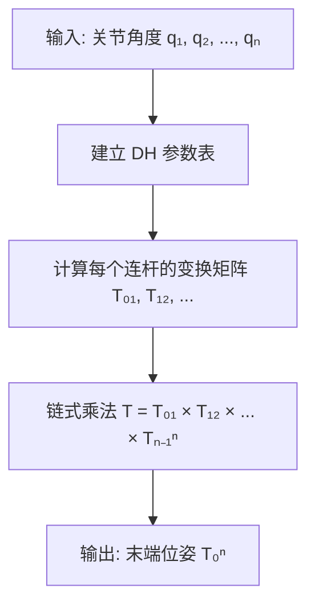

# 02-2 机器人运动学与 DH 参数

> **前置课程**：02-1 空间描述与变换
> **后续课程**：02-3 速度运动学与雅可比矩阵

> 本节对应机器人学核心：**如何从关节角度计算机器人末端的位置和姿态？**

**作者**：霍海杰 | **联系方式**：howe12@126.com

---

## 1. 引入

### 1.1 什么是正运动学？

想象一下你的手臂：
- 肩关节旋转 → 上臂移动
- 肘关节旋转 → 前臂移动
- 腕关节旋转 → 手移动

如果你知道**所有关节的角度**，能不能算出**手的位置**？

**这就是正运动学 (Forward Kinematics) 要解决的问题**：
> 给定关节变量 → 计算末端位姿

### 1.2 本节学习目标

学完本节后，你将能够：
- [ ] 理解 DH 参数的物理含义
- [ ] 掌握 4 个 DH 参数：$a, \alpha, d, \theta$
- [ ] 理解相邻连杆变换矩阵的推导
- [ ] 能用 Python 计算 2 连杆机械臂的正运动学

---

## 2. 理论部分

### 2.1 DH 参数详解

**Denavit-Hartenberg (DH) 参数**是描述相邻连杆关系的标准方法。仅需 4 个参数就能完整描述两个坐标系之间的关系：

| 参数 | 符号 | 物理含义 | 说明 |
|------|------|----------|------|
| **连杆长度** | $a_i$ | 沿 $x_i$ 轴，从 $z_{i-1}$ 到 $z_i$ 的距离 | 连杆本身的结构参数 |
| **连杆扭角** | $\alpha_i$ | 绕 $x_i$ 轴，从 $z_{i-1}$ 旋转到 $z_i$ 的角度 | 连杆本身的结构参数 |
| **关节偏距** | $d_i$ | 沿 $z_{i-1}$ 轴，从 $x_{i-1}$ 到 $x_i$ 的距离 | 移动副的关节变量 |
| **关节角度** | $\theta_i$ | 绕 $z_{i-1}$ 轴，从 $x_{i-1}$ 旋转到 $x_i$ 的角度 | 旋转副的关节变量 |

> **生活类比**：把 DH 参数想象成"连接两个水管"的接头参数。水管之间的连接需要知道：连接角度、水管长度、偏移量等。

### 2.2 变换矩阵公式推导

相邻连杆 $i-1$ 到 $i$ 的变换，可以分解为 4 步基本变换：

$$
T_{i-1}^{i} = \text{Rot}_{z}(\theta_i) \cdot \text{Trans}_{z}(d_i) \cdot \text{Trans}_{x}(a_i) \cdot \text{Rot}_{x}(\alpha_i)
$$

**逐步分解**：

1. **绕 $z_{i-1}$ 旋转 $\theta_i$**：使 $x_{i-1}$ 轴与 $x_i$ 轴平行
   $$
   R_z(\theta_i) = \begin{bmatrix}
   \cos\theta_i & -\sin\theta_i & 0 & 0 \\
   \sin\theta_i & \cos\theta_i & 0 & 0 \\
   0 & 0 & 1 & 0 \\
   0 & 0 & 0 & 1
   \end{bmatrix}
   $$

2. **沿 $z_{i-1}$ 平移 $d_i$**：将原点移动到关节 $i$ 处
   $$
   T_z(d_i) = \begin{bmatrix}
   1 & 0 & 0 & 0 \\
   0 & 1 & 0 & 0 \\
   0 & 0 & 1 & d_i \\
   0 & 0 & 0 & 1
   \end{bmatrix}
   $$

3. **沿 $x_i$ 轴平移 $a_i$**：移动到下一个连杆的原点
   $$
   T_x(a_i) = \begin{bmatrix}
   1 & 0 & 0 & a_i \\
   0 & 1 & 0 & 0 \\
   0 & 0 & 1 & 0 \\
   0 & 0 & 0 & 1
   \end{bmatrix}
   $$

4. **绕 $x_i$ 轴旋转 $\alpha_i$**：使 $z_{i-1}$ 轴与 $z_i$ 轴对齐
   $$
   R_x(\alpha_i) = \begin{bmatrix}
   1 & 0 & 0 & 0 \\
   0 & \cos\alpha_i & -\sin\alpha_i & 0 \\
   0 & \sin\alpha_i & \cos\alpha_i & 0 \\
   0 & 0 & 0 & 1
   \end{bmatrix}
   $$

**完整的 DH 变换矩阵**：

$$
T_{i-1}^{i} = \begin{bmatrix}
\cos\theta_i & -\sin\theta_i\cos\alpha_i & \sin\theta_i\sin\alpha_i & a_i\cos\theta_i \\
\sin\theta_i & \cos\theta_i\cos\alpha_i & -\cos\theta_i\sin\alpha_i & a_i\sin\theta_i \\
0 & \sin\alpha_i & \cos\alpha_i & d_i \\
0 & 0 & 0 & 1
\end{bmatrix}
$$

### 2.3 正运动学计算流程



---

## 3. 代码实现

### 3.1 DH 矩阵计算函数

```python
import numpy as np

def dh_matrix(theta, d, a, alpha):
    """
    根据标准 DH 参数计算变换矩阵 T_{i-1, i}
    
    参数:
        theta: 关节角度 (弧度)
        d: 关节偏距 (米)
        a: 连杆长度 (米)
        alpha: 连杆扭角 (弧度)
    
    返回:
        4x4 变换矩阵
    """
    ct, st = np.cos(theta), np.sin(theta)
    ca, sa = np.cos(alpha), np.sin(alpha)
    
    return np.array([
        [ct, -st*ca,  st*sa, a*ct],
        [st,  ct*ca, -ct*sa, a*st],
        [0,   sa,     ca,    d   ],
        [0,   0,      0,     1   ]
    ])
```

### 3.2 2 连杆机械臂正运动学

```python
def forward_kinematics_2link(joint_angles, link_lengths):
    """
    计算 2 连杆平面机械臂的末端位置
    
    参数:
        joint_angles: [theta1, theta2] 关节角度 (弧度)
        link_lengths: [L1, L2] 连杆长度 (米)
    
    返回:
        T_02: 末端相对于基座的变换矩阵
    """
    theta1, theta2 = joint_angles
    L1, L2 = link_lengths
    
    # 连杆 1: frame 0 -> frame 1
    # theta=q1, d=0, a=L1, alpha=0 (平面机构，扭转角为0)
    T_01 = dh_matrix(theta1, 0, L1, 0)
    
    # 连杆 2: frame 1 -> frame 2
    # theta=q2, d=0, a=L2, alpha=0
    T_12 = dh_matrix(theta2, 0, L2, 0)
    
    # 总变换矩阵: T_02 = T_01 × T_12
    T_02 = T_01 @ T_12
    
    return T_02
```

### 3.3 验证示例

```python
# ========== 验证测试 ==========
if __name__ == "__main__":
    L1, L2 = 1.0, 1.0  # 两段连杆长度各 1 米
    
    # 测试用例
    test_cases = [
        {"name": "手臂水平伸直", "q": [0, 0], "expected": (2.0, 0.0, 0.0)},
        {"name": "手臂垂直向上", "q": [np.pi/2, 0], "expected": (0.0, 2.0, 0.0)},
        {"name": "手臂 L 形", "q": [0, np.pi/2], "expected": (1.0, 1.0, 0.0)},
    ]
    
    print("=" * 50)
    print("2 连杆机械臂正运动学验证")
    print("=" * 50)
    
    for tc in test_cases:
        q = tc["q"]
        expected = tc["expected"]
        
        T = forward_kinematics_2link(q, [L1, L2])
        pos = T[:3, 3]  # 提取位置
        
        print(f"\n【{tc['name']}】")
        print(f"  关节角度: θ₁={np.degrees(q[0]):.1f}°, θ₂={np.degrees(q[1]):.1f}°")
        print(f"  计算位置: ({pos[0]:.4f}, {pos[1]:.4f}, {pos[2]:.4f})")
        print(f"  期望位置: {expected}")
        
        # 验证误差
        error = np.linalg.norm(pos - np.array(expected))
        print(f"  误差: {error:.6f} {'✓' if error < 1e-6 else '✗'}")
```

**运行结果**：

```
==================================================
2 连杆机械臂正运动学验证
==================================================

【手臂水平伸直】
  关节角度: θ₁=0.0°, θ₂=0.0°
  计算位置: (2.0000, 0.0000, 0.0000)
  期望位置: (2.0, 0.0, 0.0)
  误差: 0.000000 ✓

【手臂垂直向上】
  关节角度: θ₁=90.0°, θ₂=0.0°
  计算位置: (0.0000, 2.0000, 0.0000)
  期望位置: (0.0, 2.0, 0.0)
  误差: 0.000000 ✓

【手臂 L 形】
  关节角度: θ₁=0.0°, θ₂=90.0°
  计算位置: (1.0000, 1.0000, 0.0000)
  期望位置: (1.0, 1.0, 0.0)
  误差: 0.000000 ✓
```

---

### 程序与公式对应关系

| 公式 | 程序代码 | 说明 |
|------|----------|------|
| $T_{i-1}^{i} = \begin{bmatrix} \cos\theta & -\sin\theta\cos\alpha & \sin\theta\sin\alpha & a\cos\theta \\ \sin\theta & \cos\theta\cos\alpha & -\cos\theta\sin\alpha & a\sin\theta \\ 0 & \sin\alpha & \cos\alpha & d \\ 0 & 0 & 0 & 1 \end{bmatrix}$ | `np.array([[ct, -st*ca, st*sa, a*ct], [st, ct*ca, -ct*sa, a*st], [0, sa, ca, d], [0, 0, 0, 1]])` | 标准DH变换矩阵 |
| $x = L_1\cos\theta_1 + L_2\cos(\theta_1 + \theta_2)$ | `x = L1*np.cos(theta1) + L2*np.cos(theta1+theta2)` | 2R机械臂末端X坐标 |
| $y = L_1\sin\theta_1 + L_2\sin(\theta_1 + \theta_2)$ | `y = L1*np.sin(theta1) + L2*np.sin(theta1+theta2)` | 2R机械臂末端Y坐标 |
| $T_{0}^{2} = T_{0}^{1} \times T_{1}^{2}$ | `T_02 = T_01 @ T_12` | 链式变换（矩阵乘法） |

## 4. 部署指南

### 4.1 环境要求

- Python 3.8+
- NumPy

### 4.2 安装依赖

```bash
pip install numpy matplotlib
```

### 4.3 运行代码

```bash
python forward_kinematics.py
```

---

## 5. 练习题

### 5.1 基础题

1. **DH 参数识别**：对于一个 3 连杆机械臂，每个连杆需要几个 DH 参数？总共需要几个？
2. **坐标变换**：验证 DH 矩阵当 $\theta=0, d=0, a=1, \alpha=0$ 时的结果。
3. **手算验证**：对于 2 连杆机械臂，若 $L_1=L_2=0.5m$，$\theta_1=45°$，$\theta_2=45°$，计算末端位置。

### 5.2 进阶题

1. **编写函数**：编写 3 连杆机械臂的正运动学函数 `forward_kinematics_3link(q, L)`。
2. **姿态验证**：修改代码，不仅计算位置，还计算末端的姿态（旋转矩阵）。
3. **可视化**：使用 matplotlib 绘制 2 连杆机械臂在不同关节角度下的示意图。

### 5.3 答案

**基础题 3**：
$$
x = L_1\cos45° + L_2\cos(45°+45°) = 0.5 \times 0.707 + 0.5 \times 0.707 = 0.707m
$$
$$
y = L_1\sin45° + L_2\sin(45°+45°) = 0.5 \times 0.707 + 0.5 \times 1.0 = 0.854m
$$

---

## 6. 本章小结

| 概念 | 说明 |
|------|------|
| **正运动学** | 已知关节角 → 求末端位姿 |
| **DH 参数** | 描述相邻连杆关系的 4 个参数：$a, \alpha, d, \theta$ |
| **变换矩阵** | $T_{i-1}^i = \text{Rot}_z(\theta)\text{Trans}_z(d)\text{Trans}_x(a)\text{Rot}_x(\alpha)$ |
| **链式法则** | 末端位姿 = 所有变换矩阵连乘 |

---

## 6. 思考题

> 为什么 DH 参数只需要 4 个参数就能描述两个坐标系的关系？如果不用 DH 方法，你还能用什么方法描述？

---

## 思考题答案

### 基础题答案

1. **DH 参数识别**：对于一个 3 连杆机械臂，每个连杆需要几个 DH 参数？总共需要几个？
   - 每个连杆需要4个DH参数（$a, \alpha, d, \theta$）
   - 3连杆机械臂共需要 $3 \times 4 = 12$ 个参数
   - 其中第一个关节通常作为基座，$d_1$ 或 $\theta_1$ 为变量

2. **坐标变换**：验证 DH 矩阵当 $\theta=0, d=0, a=1, \alpha=0$ 时的结果。
   - 代入公式：$\cos(0)=1, \sin(0)=0, \cos(0)=1, \sin(0)=0$
   - $T = \begin{bmatrix} 1 & 0 & 0 & 1 \\ 0 & 1 & 0 & 0 \\ 0 & 0 & 1 & 0 \\ 0 & 0 & 0 & 1 \end{bmatrix}$（沿X轴平移1单位）

3. **手算验证**：对于 2 连杆机械臂，若 $L_1=L_2=0.5m$，$\theta_1=45°$，$\theta_2=45°$，计算末端位置。
   - $x = 0.5\cos45° + 0.5\cos(45°+45°) = 0.5 \times 0.707 + 0.5 \times 0.707 = 0.707m$
   - $y = 0.5\sin45° + 0.5\sin(45°+45°) = 0.5 \times 0.707 + 0.5 \times 1.0 = 0.854m$

### 进阶题答案

1. **编写函数**：编写 3 连杆机械臂的正运动学函数 `forward_kinematics_3link(q, L)`。
   ```python
   def forward_kinematics_3link(joint_angles, link_lengths):
       theta1, theta2, theta3 = joint_angles
       L1, L2, L3 = link_lengths
       
       T_01 = dh_matrix(theta1, 0, L1, 0)
       T_12 = dh_matrix(theta2, 0, L2, 0)
       T_23 = dh_matrix(theta3, 0, L3, 0)
       
       T_03 = T_01 @ T_12 @ T_23
       return T_03
   ```

2. **姿态验证**：修改代码，不仅计算位置，还计算末端的姿态（旋转矩阵）。
   - 位置：取 `T[:3, 3]`
   - 姿态（旋转矩阵）：取 `T[:3, :3]`

### 思考题答案

- **为什么只需要4个参数？** 因为描述两个坐标系之间的相对位姿确实只需要：绕x轴旋转($\alpha$)、沿x轴平移($a$)、绕z轴旋转($\theta$)、沿z轴平移($d$)。这4个参数足以确定两个坐标系之间的变换关系。
- **其他方法**：可以用齐次变换矩阵（4×4=16个参数，但有冗余）、四元数+位置向量、李群SE(3)等方式描述。

---

*下节预告：学习了位置，我们来学习速度！了解雅可比矩阵如何连接关节速度和末端速度。*
