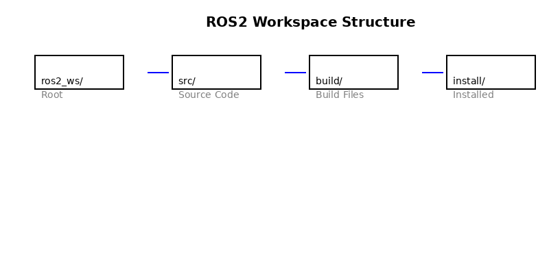
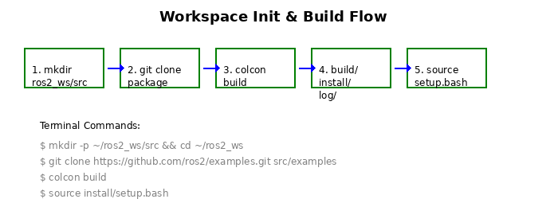
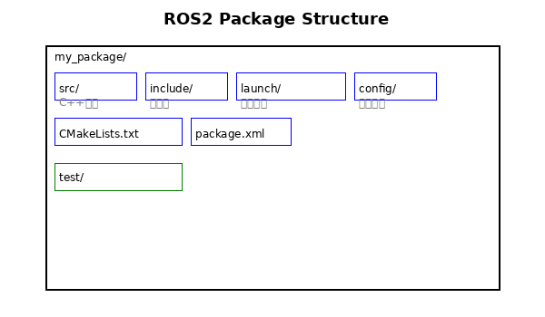

# 04-4 ROS2工作空间

**作者**：霍海杰 | **联系方式**：howe12@126.com

---

> **前置说明**：在上一节中，我们已经完成了ROS2的安装和环境验证。现在，我们将深入学习ROS2开发的基础知识——工作空间。工作空间（Workspace）是ROS2项目开发和管理的核心概念，理解工作空间的组织结构是掌握ROS2开发的第一步。本节将详细讲解ROS2工作空间的标准目录结构、创建流程以及功能包的规范要求。

---

## 1. ROS2工作空间概述

### 1.1 什么是工作空间

工作空间（Workspace）是ROS2项目开发和管理的物理目录结构，它包含了项目的所有源代码、编译产物、安装文件和配置文件。一个规范的工作空间不仅能帮助开发者高效管理代码，还能避免常见的依赖和路径问题。

在ROS2开发中，工作空间采用层级目录结构，不同层级的目录承担不同的职责。这种设计借鉴了Linux系统的文件系统组织理念，使得代码管理更加清晰和规范。理解工作空间的组织方式，对于后续的包开发、编译和部署都至关重要。

### 1.2 为什么需要工作空间

想象一下，如果你把所有代码都放在一个文件夹里，随着项目规模增大，你会发现文件难以分类、编译冲突频发、版本管理困难。工作空间的出现就是为了解决这些问题，它提供了一种结构化的方式来组织和管理ROS2项目。

工作空间的核心优势包括：代码隔离——不同项目可以独立编译运行，不会相互干扰；版本控制友好——清晰的目录结构便于Git等版本管理工具使用；团队协作方便——团队成员可以在各自目录开发，最后整合；环境管理——编译和安装过程产生的文件与源码分离，便于清理和重编译。

---

## 2. 标准目录结构

### 2.1 四层目录详解

ROS2工作空间采用标准的四层目录结构，每一层都有明确的职责和用途。


*图注：ROS2工作空间的四层目录结构示意*

**src目录**（源码层）

src目录是工作空间的核心，存放所有的源代码文件。当你克隆ROS2仓库或创建新功能包时，它们的源码都放在这个目录下。这个目录是唯一需要你手动创建和维护的，其他三个目录都由编译工具自动生成。

在src目录下，每个功能包（Package）都有自己独立的子目录。功能包是ROS2代码组织的基本单元，包含了节点的源码、配置文件、launch文件等。一个典型的工作空间可能包含十几个甚至上百个功能包，它们之间通过依赖关系相互关联。

**build目录**（编译层）

build目录存放编译过程中产生的中间文件。当你执行colcon build命令时，编译工具会在这里为每个功能包创建构建目录，存放CMake的缓存文件、编译目标文件等。这些文件用于加速后续编译，但并不影响最终的运行。

build目录的内容可以随时删除，重新编译时会自动生成。这也意味着，如果遇到奇怪的编译错误，删除build目录并重新编译往往是有效的解决方案。

**install目录**（安装层）

install目录是编译产物最终的安装位置。当你执行colcon build或colcon install命令后，每个功能包的可执行文件、库文件、配置文件等都会被安装到这里。在运行ROS2节点时，系统会从这个目录查找所需的资源。

install目录的结构与src目录对应，每个功能包都有自己的安装子目录。要运行某个节点时，需要先source对应的setup.bash文件，将install目录添加到ROS2的环境变量中。

**log目录**（日志层）

log目录存放编译和测试过程的日志文件。当colcon build或colcon test执行时，详细的执行日志会保存在这里。如果编译失败或测试未通过，查看log目录中的日志文件可以帮助定位问题原因。

log目录是可选的，只有在执行colcon命令时才会生成。默认情况下，日志文件会保留最近几次的编译记录，便于问题排查。

### 2.2 目录结构示例

```
my_ros2_ws/
├── src/                    # 源代码目录（需手动创建）
│   ├── package_a/           # 功能包A
│   │   ├── src/
│   │   ├── include/
│   │   ├── CMakeLists.txt
│   │   └── package.xml
│   ├── package_b/          # 功能包B
│   └── ...
├── build/                   # 编译目录（自动生成）
│   ├── package_a/
│   ├── package_b/
│   └── ...
├── install/                # 安装目录（自动生成）
│   ├── package_a/
│   ├── setup.bash          # 环境设置脚本
│   └── ...
└── log/                    # 日志目录（自动生成）
    ├── build_2024_01_01/
    └── ...
```

---

## 3. 工作空间创建流程

### 3.1 初始化工作空间

创建ROS2工作空间的第一步是建立src目录并完成基本的仓库初始化。以下是完整的初始化流程：

```bash
# 1. 创建工作空间根目录
mkdir -p ~/ros2_ws/src

# 2. 进入工作空间
cd ~/ros2_ws

# 3. 初始化为Git仓库（推荐）
git init

# 4. 克隆ROS2示例或现有功能包
git clone https://github.com/ros2/examples.git src/examples
```

这个过程中，需要特别注意src目录的创建。ROS2的编译工具会在工作空间根目录查找src、build、install、log四个特定名称的子目录，因此目录名称必须完全匹配，不能有任何拼写错误。


*图注：使用mkdir和cd创建ROS2工作空间*

初始化完成后，工作空间目录结构还很简单，只有一个空的src目录。此时执行colcon build命令会报错，因为src目录中没有可编译的功能包。

### 3.2 编译工作空间

初始化完成后，就可以使用colcon工具编译工作空间了。colcon是ROS2的构建工具，类似于ROS1中的catkin_make。

```bash
# 进入工作空间目录
cd ~/ros2_ws

# 编译所有功能包
colcon build

# 编译完成后，检查生成的文件
ls -la
```

执行colcon build命令后，你会看到编译过程在终端输出详细信息。编译成功后，工作空间中会增加build、install、log三个目录。每个功能包都会在build目录中生成编译产物，在install目录中生成可执行文件。

### 3.3 环境配置

编译完成后，在运行任何ROS2节点之前，需要先设置环境变量。这一步通过source安装目录中的setup.bash文件来完成。

```bash
# 方法1：临时设置（只对当前终端生效）
source ~/ros2_ws/install/setup.bash

# 方法2：永久设置（添加到.bashrc）
echo "source ~/ros2_ws/install/setup.bash" >> ~/.bashrc
source ~/.bashrc
```

环境设置的本质是将工作空间的install目录添加到ROS2的环境变量中。这样当你启动ROS2节点时，系统才能找到对应的可执行文件和消息定义。

---

## 4. 功能包规范

### 4.1 什么是功能包

功能包（Package）是ROS2代码组织的基本单元。每个功能包都是独立的最小可发布单元，包含可运行的节点、配置文件、launch文件等。理解功能包的结构是ROS2开发的基础。

功能包的设计遵循"高内聚、低耦合"的原则。一个功能包应该完成一个完整的功能，比如一个传感器驱动、一个导航算法或一个控制节点。功能包之间通过明确的接口（话题、服务、动作）进行通信，互不直接依赖内部实现。

### 4.2 功能包目录结构

一个标准的ROS2功能包包含以下文件和目录：

```
my_package/
├── src/                    # C++源代码目录
│   └── my_node.cpp
├── include/                # C++头文件目录
├── CMakeLists.txt         # CMake编译配置
├── package.xml            # 包清单文件
├── launch/                # launch文件目录
│   └── my_launch.py
├── config/                # 参数配置文件
│   └── params.yaml
└── test/                 # 测试文件目录
```


*图注：ROS2功能包的标准目录结构*

### 4.3 package.xml详解

package.xml是功能包的清单文件，定义了包的基本信息、依赖关系和元数据。每个ROS2功能包必须包含这个文件，它相当于功能包的"身份证"。

```xml
<?xml version="1.0"?>
<?xml-model href="http://download.ros.org/schema/package_format3.xsd" schematypens="http://www.w3.org/2001/XMLSchema"?>
<package format="3">
  <name>my_package</name>
  <version>0.1.0</version>
  <description>My first ROS2 package</description>

  <maintainer email="user@example.com">Your Name</maintainer>
  <license>Apache-2.0</license>

  <buildtool_depend>ament_cmake</buildtool_depend>
  
  <depend>rclcpp</depend>
  <depend>std_msgs</depend>

  <test_depend>ament_lint_auto</test_depend>
  <test_depend>ament_lint_common</test_depend>

  <export>
    <build_type>ament_cmake</build_type>
  </export>
</package>
```

package.xml文件的关键元素包括：name（包名）、version（版本号）、description（描述）、maintainer（维护者）、license（许可证）、buildtool_depend（构建工具依赖）、depend（运行依赖）等。正确声明依赖关系非常重要，它决定了功能包能否正确编译和运行。

### 4.4 CMakeLists.txt详解

CMakeLists.txt是CMake构建系统的配置文件，定义了如何编译功能包中的源代码。它告诉编译工具需要编译哪些文件、生成哪些可执行文件、安装哪些配置文件。

```cmake
cmake_minimum_required(VERSION 3.8)
project(my_package)

if(CMAKE_COMPILER_IS_GNUCXX OR CMAKE_CXX_COMPILER_ID MATCHES "Clang")
  add_compile_options(-Wall -Wextra -Wpedantic)
endif()

# 查找依赖
find_package(ament_cmake REQUIRED)
find_package(rclcpp REQUIRED)
find_package(std_msgs REQUIRED)

# 创建可执行文件
add_executable(my_node src/my_node.cpp)

# 创建目标依赖
ament_target_dependencies(my_node
  rclcpp
  std_msgs
)

# 安装可执行文件
install(TARGETS my_node
  DESTINATION lib/${PROJECT_NAME}
)

# 安装launch文件
install(DIRECTORY launch/
  DESTINATION share/${PROJECT_NAME}/launch
)

# 测试
if(BUILD_TESTING)
  find_package(ament_lint_auto REQUIRED)
  ament_lint_auto_find_test_dependencies()
endif()

ament_package()
```

CMakeLists.txt的编写需要一定的CMake知识，但它遵循固定的模式。理解其基本结构后，你可以快速上手新的功能包开发。

### 4.5 目录命名规则

ROS2功能包的目录和文件命名遵循一定的规则，这些规则不是强制的，但遵循它们可以让代码更加规范，便于团队协作。

目录命名应使用小写字母和下划线，例如：`my_package`、`path_planning`、`sensor_drivers`。避免使用大写字母、数字或特殊字符。文件名同样遵循这一规则，`my_node.cpp`比`MyNode.cpp`更符合ROS2的惯例。

包名（package.xml中声明的name）必须全局唯一，不能与其他包冲突。在创建新包之前，最好先搜索ROS2社区，确认没有同名包已经存在。

---

## 5. 依赖管理

### 5.1 rosdep工具

rosdep是ROS2的依赖管理工具，能够自动安装功能包所需的系统依赖。在编译ROS2项目之前，使用rosdep可以确保所有必要的系统库都已安装。

```bash
# 安装工作空间所有包的系统依赖
cd ~/ros2_ws
rosdep install --from-paths src --ignore-src -r -y
```

rosdep会读取package.xml文件中的依赖声明，检查系统中是否已安装相应的库，如果缺失则提示安装。这个工具大大简化了环境配置过程，特别是在新系统上搭建开发环境时非常有用。

---

## 本章小结

本章我们详细学习了ROS2工作空间的核心知识。在目录结构部分，我们了解到ROS2工作空间由src、build、install、log四个标准目录组成，每个目录都有明确的职责：src存放源码、build存放编译中间文件、install存放最终产物、log存放编译日志。

在工作空间创建流程部分，我们掌握了使用mkdir创建目录、使用colcon build编译、使用source setup.bash配置环境的完整流程。这些操作是ROS2开发的基础中的基础。

在功能包规范部分，我们学习了package.xml和CMakeLists.txt的作用和基本写法，理解了功能包作为ROS2代码组织基本单元的重要地位。

---

## 思考与练习

1. 动手练一练：创建一个新的ROS2工作空间，克隆一个示例功能包并完成编译和环境配置。
2. 想一想：为什么ROS2要采用src/build/install/log四层目录结构？这种设计有什么优点？
3. 查一查：你使用的ROS2版本有哪些常用的功能包？它们的依赖是如何声明的？

---

## 参考资料

### 官方文档

1. ROS2 Workspace Documentation: <https://docs.ros.org/en/rolling/Tutorials/Beginner-Client-Libraries/Creating-A-Workspace/Creating-A-Workspace.html>
2. Building ROS2 Packages: <https://docs.ros.org/en/rolling/Tutorials/Beginner-Client-Libraries/Colcon-Tutorial.html>
3. package.xml Documentation: <https://docs.ros.org/en/rolling/Concepts/About-Packages.html>

### 补充阅读

4. Understanding the ROS2 Build System: <https://docs.ros.org/en/rolling/Concepts/About-Build-System.html>
5. Ament CMake Documentation: <https://docs.ros.org/en/rolling/How-To-Guides/Ament-CMake-Documentation.html>

---

*下一节我们将学习"2.2 Colcon构建工具深度应用"，深入了解ROS2的编译工具和优化技巧。准备好了吗？让我们继续深入ROS2的世界吧！*
