# 舞蹈机器人复刻环境部署

## 1. 项目概述

### 1.1 项目目标

**输入**：文本动作描述或舞蹈视频\
**输出**：机器人动作文件（robot\_motion\*.pkl）与可视化结果

本项目的核心目标是：

让没有任何编程经验的用户也能生成机器人舞蹈动作

支持多人轨迹（all tracks）与多机器人 MuJoCo 录制

打通从视频到仿真验证的完整流程

### 1.2 核心技术流程

```bash

┌─────────────┐ ┌──────────────┐ ┌─────────┐ ┌──────────────┐\

│ 视频/Prompt │ → │ PromptHMR │ → │ SMPL-X │ → │ GMR │\

└─────────────┘ └──────────────┘ └─────────┘ └──────────────┘\

↓\

┌──────────────┐\

│ 机器人动作 │\

└──────────────┘

```

**流程说明**：

**PromptHMR**：将视频或文本描述转换为人体3D姿态（SMPL-X格式）

**SMPL-X**：一种参数化人体模型，包含身体、手势、面部表情

**GMR**：把人体动作\"翻译\"成机器人可执行的动作

### 1.3 技术栈

  ------------ ----------------------------------
  组件         说明
  PromptHMR    文本/图像驱动的人体姿态估计
  SMPL-X       人体3D姿态模型（身体+手势+表情）
  GMR          机器人动作生成模型
  Viser        Web可视化工具
  MuJoCo       物理仿真引擎
  Unitree G1   目标机器人模型
  ------------ ----------------------------------

## 2. 部署环境

## 2.1 云端部署

#### 2.1.1 租借容器

云算力平台（算力自由）：https://www.gpufree.cn/

平台中有许多镜像仓库，我这边选择**IsaacSim5.0 及 ROS2**，方便之后可能有的额外开发

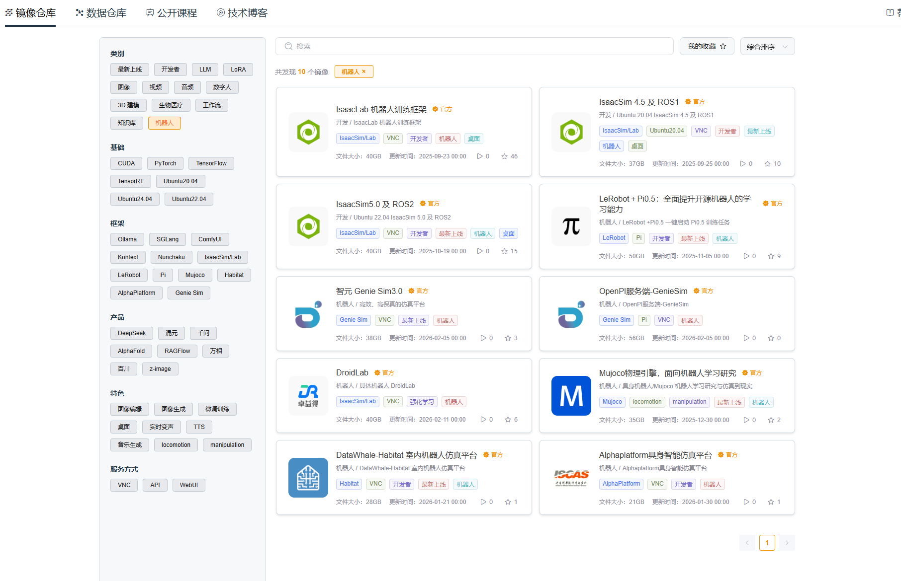

主要性能也能满足我们的开发

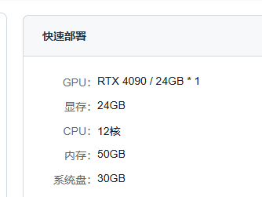

可以根据需求增加一些数据盘容量

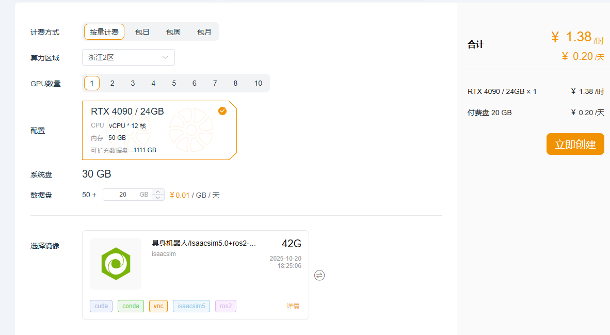

等待拉取成功就好啦

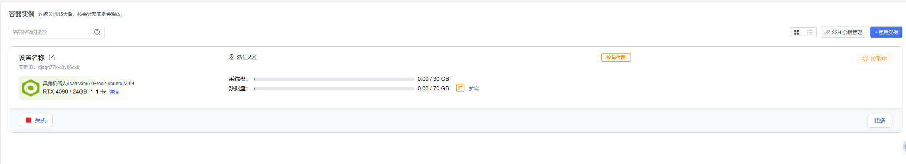

访问云服务器的端口时，可以直接通过VNC访问其图形界面


  --------------------------------------------------------
  如果不需要可视化界面，只用终端的情况可以使用JupyterLab
  --------------------------------------------------------

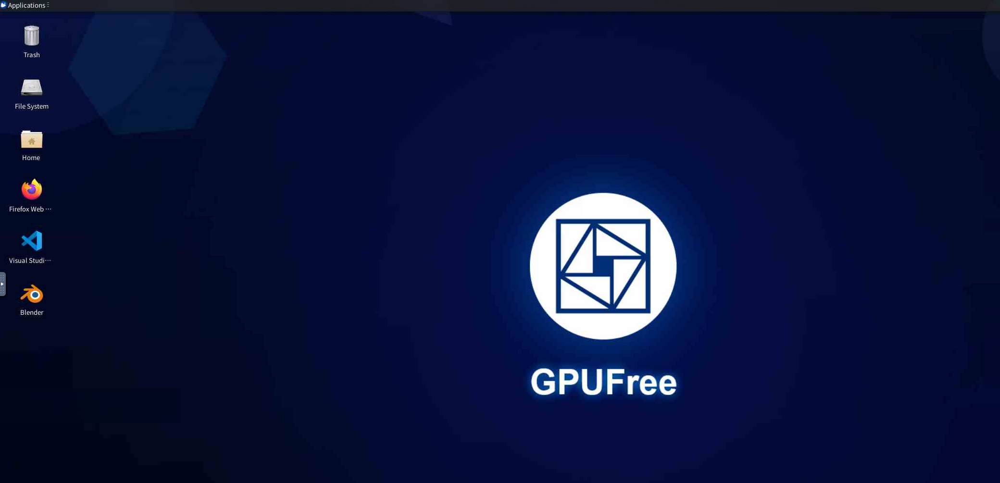

#### 2.1.2 部署课程仓库

**步骤1 添加git代理**

在容器中，关于Github相关内容可以参考https://www.gpufree.cn/docs/guide/tips/github.html

直接配置gh-proxy.org的为全局代理，后续所有的git操作都将通过gh-proxy.org进行加速。

使用ctrl+alt+t打开终端，或者点击下侧栏中的终端符号启动

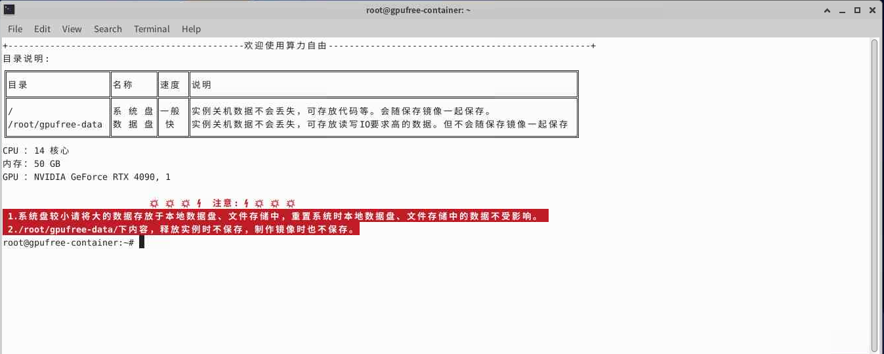

复制部分使用左侧的剪贴板

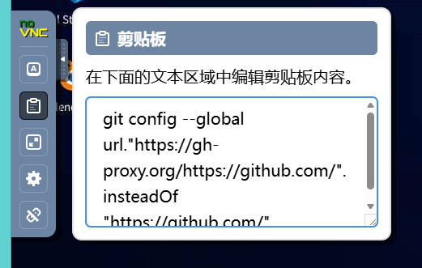

```bash

\# 配置全局代理\

git config \--global url.\"https://gh-proxy.org/https://github.com/\".insteadOf \"https://github.com/\"

```

然后就可以在终端中进行复制，如果是用鼠标，可以点击鼠标中键进行复制

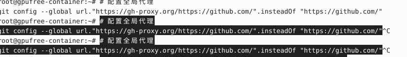

**步骤2 clone课程仓库**

```bash

cd gpufree-data\

git clone https://github.com/datawhalechina/every-embodied.git

```

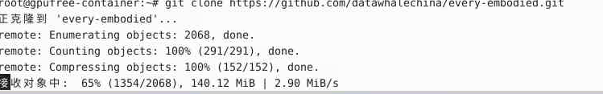

**步骤3 clone GMR**

然后cd 到对应的路径中，可以复制也可以使用tab补全

```bash

cd every-embodied/07-机器人操作、运动控制/Locomotion/video2robot/third\_party

```

clone GMR ，**GMR** 能 "学习" 人类的动作特征，再把这些特征**转换为机器人关节能执行的运动轨迹**，让机器人的动作更贴近人类、更流畅自然，而非机械的关节角度切换。

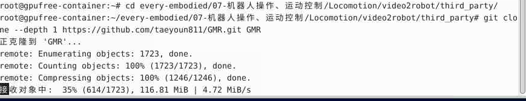

**步骤4 Clone PromptHMR**

```bash

git clone \--depth 1 https://github.com/taeyoun811/PromptHMR.git PromptHMR

```

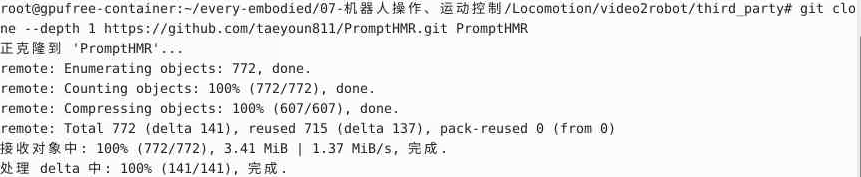

至此，两个关键包已下载完成

**步骤5 应用patch**

如果你拿到的是 patch 交付包，再应用 3 个 patch：

```bash

cd ..\

git apply patches/main.patch\

git -C third\_party/PromptHMR apply ../../patches/prompthmr.patch\

git -C third\_party/GMR apply ../../patches/gmr.patch

```

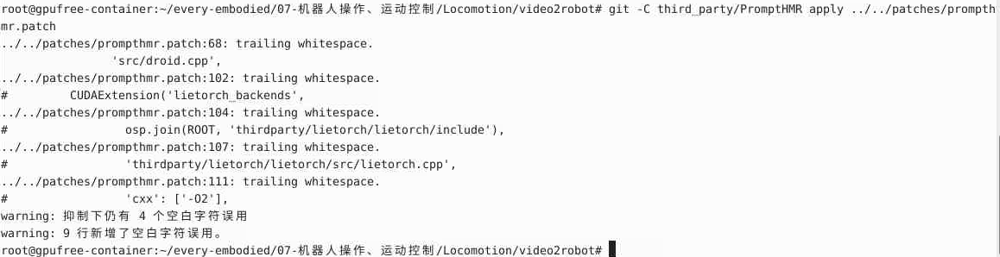

| 这些 trailing whitespace（尾行空白）警告，本质是：补丁文件（prompthmr.patch）中部分代码行的**末尾多了空格 / 制表符 / 换行符**，Git 在应用补丁时检测到了这种不规范的代码格式，所以给出警告，但并不会中断补丁应用。 |
| ✅ **无功能影响，所以我们可以放心使用**                                                                                                                                                                            |

#### 2.1.3 conda环境安装

**步骤1 安装GMR 环境**

conda在我的这个镜像中已经安装了，所以直接使用就可以，**下述pip库均在gmr环境中**

```bash

conda create -n gmr python=3.10 -y\

conda activate gmr\

cd /root/every-embodied/07-机器人操作、运动控制/Locomotion/video2robot\

pip install -e .\

\# gmr下还需要安装\

\

pip install loop-rate-limiters\

pip install smplx\

pip install imageio\

pip install mink\

pip install rich\

pip install imageio\[ffmpeg\]

```

**步骤2 安装PromptHMR 环境**

由于PromptHMR 需要较多的工程依赖，版本的影响因素比较大，所以采用部分手动下载源码，大部分采用一键安装库文件的形式,**过程约20-30分钟，下述pip库均在phmr环境中**

**步骤2.1 创建conda环境**

```bash

conda create -n phmr python=3.10 -y\

conda activate phmr\

cd /root/every-embodied/07-机器人操作、运动控制/Locomotion/video2robot/third\_party/PromptHMR\

pip install -r requirements.txt

```

**步骤2.2 添加路径到bashrc**

```bash

\# 在 bashrc 中加入\

echo \'export PYTHONPATH=\$PYTHONPATH:/root/gpufree-data/every-embodied/07-机器人操作、运动控制/Locomotion/video2robot/third\_party/PromptHMR\' \>\> \~/.bashrc\

echo \'export LD\_LIBRARY\_PATH=\"/root/gpufree-data/conda\_envs/phmr/lib/python3.10/site-packages/torch/lib:/usr/lib/x86\_64-linux-gnu:/usr/local/cuda/lib64:/usr/lib64:/usr/local/lib\"\' \>\> \~/.bashrc\

source \~/.bashrc

```

**步骤2.3 安装chumpy**

```bash

\# 在PromptHMR下make\

mkdir -p python\_libs\

git clone https://github.com/Arthur151/chumpy python\_libs/chumpy\

python -m pip install -e python\_libs/chumpy \--no-build-isolation

```

**步骤2.4 lietorch**

```bash

\# 编译 lietorch\

cd ../../python\_libs/\

git clone https://github.com/princeton-vl/lietorch.git\

cd lietorch\

git submodule update \--init \--recursive\

python setup.py install

```

**步骤2.5 安装droidcalib**

```bash

\

conda install -c conda-forge eigen -y\

\# 编译droidcalib\

source /opt/conda/etc/profile.d/conda.sh\

conda activate phmr\

\

conda install -c conda-forge eigen -y\

export CPATH=\"\$CONDA\_PREFIX/include/eigen3:\${CPATH:-}\"\

\

cd \~root/gpufree-data/every-embodied/07-机器人操作、运动控制/Locomotion/video2robot/third\_party/PromptHMR/pipeline/droidcalib\

python setup.py install

```

**步骤2.6 detectron2**

```bash

\# 安装 detectron2\

cd ..\

git clone https://github.com/facebookresearch/detectron2.git\

cd detectron2\

pip install -e . \--no-build-isolation

```

**步骤2.7 SAM2**

```bash

\# 安装 SAM2\

cd ..\

git clone https://github.com/facebookresearch/segment-anything-2.git\

cd segment-anything-2\

pip install -e . \--no-build-isolation

```

**步骤2.7 适配代码**

```bash

\

\# 适配代码\

sed -i \'s/load\_video\_frames, load\_video\_frames\_from\_np/load\_video\_frames/g\' /root/gpufree-data/every-embodied/07-机器人操作、运动控制/Locomotion/video2robot/third\_party/PromptHMR/pipeline/detector/sam2\_video\_predictor.py\

\

\#补充pip包\

\

python -m pip install -U torch-scatter \--no-build-isolation \#这个命令运行较久，请耐心等待\

python -m pip install -U xformers

```

**步骤2.8 安装剩余依赖**

然后注释phmr.yml文件中和我们系统路径不一致的地方（包括上述已完整的包也注释一下），文件路径为root/every-embodied/07-机器人操作、运动控制/Locomotion/video2robot/envs/*phmr.yml*

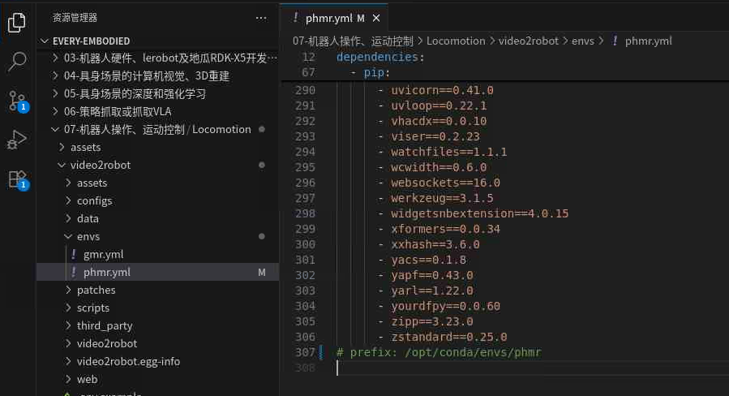

运行自动脚本安装pip库

```bash

*conda env update -n phmr -f envs/phmr.yml \--prune*

```

#### 2.1.4 下载PromptHMR相关资源

这个算是资源大全包了，其中的关键是需要的smpl暂时不知道在哪里下的，最好的下载路径是～PromptHMR/data，**过程约30分钟，要下载14G左右的资源**

**步骤 1：创建下载脚本**

```bash

cd /root/every-embodied/07-机器人操作、运动控制/Locomotion/video2robot/third\_party/PromptHMR\

touch download\_hf\_repo.py

```

**步骤 2：写入以下代码（复制粘贴）**

```bash

import os\

from huggingface\_hub import snapshot\_download\

\

\# 配置国内镜像（关键）\

os.environ\[\"HF\_ENDPOINT\"\] = \"https://hf-mirror.com\"\

os.environ\[\"HF\_HUB\_ENABLE\_HF\_TRANSFER\"\] = \"1\"\

\# 核心下载逻辑\

if \_\_name\_\_ == \"\_\_main\_\_\":\

\# 仓库ID\

repo\_id = \"Datawhale/spring-festival-wushu-robot-replication-model\"\

\# 本地保存路径（可修改为你需要的路径）\

local\_dir = \"spring-festival-wushu-robot-replication-model\"\

print(\"开始下载仓库，支持断点续传\...\")\

snapshot\_download(\

repo\_id=repo\_id,\

local\_dir=local\_dir,\

resume\_download=True, \# 断点续传\

local\_dir\_use\_symlinks=False, \# 所见即所得\

force\_download=False) \# 已下载文件不重复下载\

print(f\"✅ 下载完成！文件保存在：{os.path.abspath(local\_dir)}\")

```

**步骤 3：运行脚本**

```bash

\# 用python3执行（避免python2兼容问题）\

python3 download\_hf\_repo.py

```

该脚本无需依赖 huggingface-cli 命令，直接通过 Python 调用 API 下载，兼容性 100%。

> 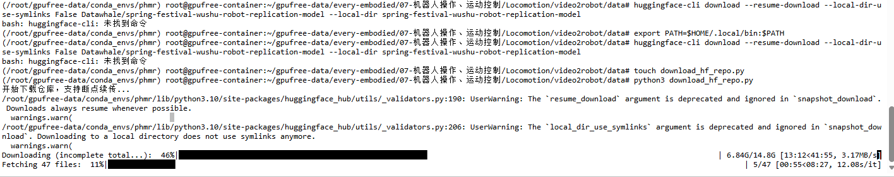

**下载好后将上述下载中的data数据放置在PromptHMR/data中！**

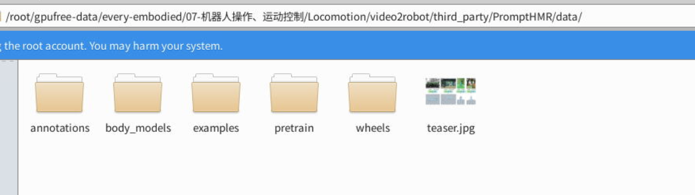

**确保文件如上图放置！！**

#### 2.1.5 模型资源放置

Vision v0.10.0（PyTorch官方视觉库）

支撑DeepLabV3人体分割，在进行视频提取姿态时，会运用到，如果没有会自动下载，速度会比较慢，所以为了避免触发下载，可以先将其放置好，**关键名字要对（v0.10.0）**。
| 放置位置： /root/.cache/torch/hub/v0.10.0                                  |

我们根据参考链接下载到本地后，可以通过JupyterLab将压缩包上传到服务器上。

```bash

mkdir -p /root/.cache/torch/hub/\

mv \[你的Vision v0.10.0库\] /root/.cache/torch/hub/

```

然后我们只要创建好cache中torch调用的库文件路径，将对应库放置进去就可以了，使用命令创建和移动或者图形化拖拽过去也可以。然后查看是否在对应路径上就可以了。

```bash

\# 如果要解压\

cd /root/.cache/torch/hub/\

unzip v0.10.0

```

CLIP ViT-L-14（metaclip\_fullcc）

文本/图像特征编码，支撑PromptHMR的文本引导姿态估计。处理逻辑和上述的Vision v0.10.0同理，提前放置好，本地下载（复制链接到浏览器，需科学上网）

下载链接：https://huggingface.co/timm/vit\_large\_patch14\_clip\_224.metaclip\_2pt5b/resolve/main/open\_clip\_model.safetensors\
✅ 验证：文件名为 open\_clip\_model.safetensors，大小约 **1.6GB**。

下载好后，上传到云服务器，我用的JupyterLab的文件传输的方式，直接拖过去就可以了。

  ----------------------------------------------------------------------------------------------------------------------------------------------------
  放置位置：/root/.cache/huggingface/hub/models\--timm\--vit\_large\_patch14\_clip\_224.metaclip\_2pt5b/snapshots/main/open\_clip\_model.safetensors
  ----------------------------------------------------------------------------------------------------------------------------------------------------

```bash

\# 1. 创建缓存目录（固定路径，不能改）\

mkdir -p /root/.cache/huggingface/hub/models\--timm\--vit\_large\_patch14\_clip\_224.metaclip\_2pt5b/snapshots/main/\

\

\# 2. 复制文件到指定路径\

cp /root/open\_clip\_model.safetensors /root/.cache/huggingface/hub/models\--timm\--vit\_large\_patch14\_clip\_224.metaclip\_2pt5b/snapshots/main/\

\

\# 3. 验证：查看文件是否存在\

ls -lh /root/.cache/huggingface/hub/models\--timm\--vit\_large\_patch14\_clip\_224.metaclip\_2pt5b/snapshots/main/open\_clip\_model.safetensors

```

Metric3D（DroidCalib相机校准）

相机运动估计、内参优化，支撑视频的3D姿态提取。
| 放置位置：/root/gpufree-data/every-embodied/07-机器人操作、运动控制/Locomotion/video2robot/data/pretrain/droidcalib.pth |

```bash

\# 1. 创建目标目录（和脚本路径对应）\

mv /root/droidcalib.pth /root/gpufree-data/every-embodied/07-机器人操作、运动控制/Locomotion/video2robot/data/pretrain/\

\

\# 2. 移动文件\

mv /root/droidcalib.pth /root/gpufree-data/every-embodied/07-机器人操作、运动控制/Locomotion/video2robot/data/pretrain/\

\

\# 3. 验证\

ls -lh /root/gpufree-data/every-embodied/07-机器人操作、运动控制/Locomotion/video2robot/data/pretrain/droidcalib.pth

```

PromptHMR权重（人体网格估计核心）

PromptHMR的主权重，支撑人体3D网格/姿态估计。

| 参考：这个同样在资源包中也有                                                                                     |
| 放置位置：/root/every-embodied/07-机器人操作、运动控制/Locomotion/video2robot/data/pretrain/phmr/checkpoint.ckpt |

```bash

\# 1. 创建目标目录\

mkdir -p /root/gpufree-data/every-embodied/07-机器人操作、运动控制/Locomotion/video2robot/data/pretrain/phmr/\

\

\# 2. 移动文件，图形化拖拽过去也行\

mv \[你的checkpoint.ckpt路径\] /root/gpufree-data/every-embodied/07-机器人操作、运动控制/Locomotion/video2robot/data/pretrain/phmr/\

\

\# 3. 验证\

ls -lh /root/gpufree-data/every-embodied/07-机器人操作、运动控制/Locomotion/video2robot/data/pretrain/phmr/checkpoint.ckpt

```

找资料过程中找到的其他资源（了解就可）

> 以下是其他参考权重文件（https://drive.google.com/drive/folders/1V2q1lWTba5hOcT-bEDTv6Cxx3fbltJyg（找资料过程中找到的）），暂时先待定，不用下载先。
>
> 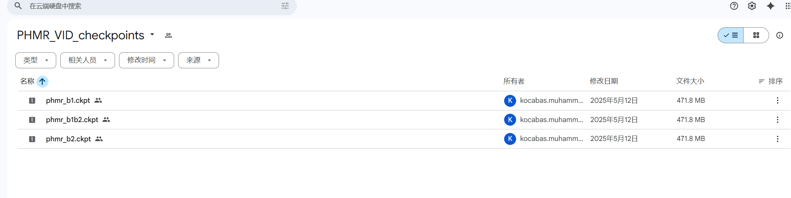

  ----------------- ------------------------------ ----------------------------------
  **权重文件**      **适配场景**                   **核心用途**
  phmr\_b1.ckpt     PromptHMR Base1 版本           基础版人体网格重建，轻量、推理快
  phmr\_b1b2.ckpt   PromptHMR Base1+Base2 融合版   精度更高，适配复杂人体姿态
  hmr\_b2.ckpt      传统 HMR Base2 版本            仅适配原始 HMR，不兼容 PromptHMR
  ----------------- ------------------------------ ----------------------------------

> 将其中的phmr\_b1.ckpt修改为checkpoint.ckpt

```bash

\# 1. 创建目标目录\

mkdir -p /root/every-embodied/07-机器人操作、运动控制/Locomotion/video2robot/data/pretrain/phmr/\

\

\# 2. 移动文件\

mv /root/checkpoint.ckpt /root/gpufree-data/every-embodied/07-机器人操作、运动控制/Locomotion/video2robot/data/pretrain/phmr/\

\

\# 3. 验证\

ls -lh /root/gpufree-data/every-embodied/07-机器人操作、运动控制/Locomotion/video2robot/data/pretrain/phmr/checkpoint.ckpt

```

#### 2.1.6 测试部署是否成功

运行提取姿态的程序，从中可以判断还缺少哪些库

```bash

conda activate phmr\

cd /root/gpufree-data/every-embodied/07-机器人操作、运动控制/Locomotion/video2robot\

python scripts/extract\_pose.py \--project data/video\_001

```

仔细看报错信息中，有没有显示缺少某个库文件的情况，然后检查是否在上述步骤中有同名的，再次运行就好了，注意主要是在phmr的conda环境中，像pip库的，要先conda activate phmr进入到conda环境后再进行安装。

### 2.2 本地部署

根据教程复刻步骤，注意需要科学上网，整体步骤与上文差不多，**主要是路径的区别，所以就提供查看本地内存与安装建议**

```bash

git clone https://github.com/datawhalechina/every-embodied.git

```

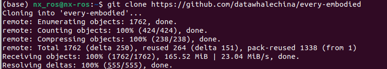

```bash

cd every-embodied/07-机器人操作、运动控制/Locomotion/video2robot\

cd third\_party

```

clone GMR ，GMR 能 "学习" 人类的动作特征，再把这些特征**转换为机器人关节能执行的运动轨迹**，让机器人的动作更贴近人类、更流畅自然，而非机械的关节角度切换。

```bash

git clone \--depth 1 https://github.com/taeyoun811/GMR.git GMR

```

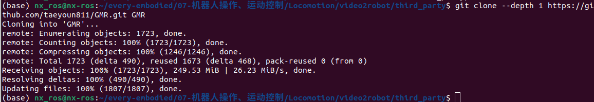

Clone PromptHMR

```bash

git clone \--depth 1 https://github.com/taeyoun811/PromptHMR.git PromptHMR

```

本章节**所有命令默认在 every-embodied/07-机器人操作、运动控制/Locomotion/video2robot 目录执行。**

所以切换到上一层，注意查看

```bash

cd ..

```

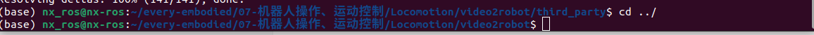

如果你拿到的是 patch 交付包，再应用 3 个 patch：

```bash

git apply patches/main.patch\

git -C third\_party/PromptHMR apply ../../patches/prompthmr.patch\

git -C third\_party/GMR apply ../../patches/gmr.patch

```

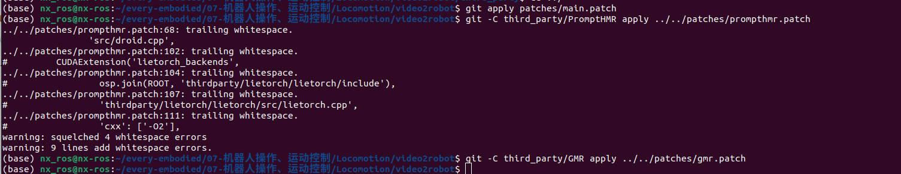

| 这些 trailing whitespace（尾行空白）警告，本质是：补丁文件（prompthmr.patch）中部分代码行的**末尾多了空格 / 制表符 / 换行符**，Git 在应用补丁时检测到了这种不规范的代码格式，所以给出警告，但并不会中断补丁应用。 |
| ✅ **无功能影响，所以我们可以放心使用**                                                                                                                                                                            |

由于配置环境所需的存储空间较大（约80g），所以需要确保自身的存储空间够大，以下是针对我自身的存储空间的查询情况，详细如下
```bash
查询conda env 存储位置\
conda config \--show envs\_dirs
---------------------------------
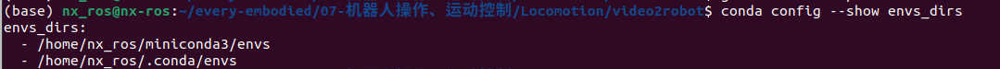
查询空间大小
-------------------------------------
df -h /home/nx\_ros/miniconda3/envs
-------------------------------------
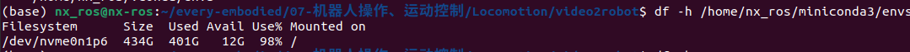
如上我的就只剩下12G，显然是不够的，所以查询所有的硬盘空间
-------------
df -h
-------------
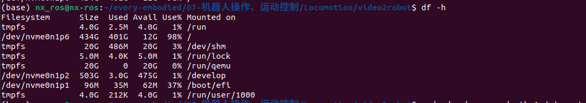
可以看到我路径下/develop的空间较多，所以将conda安装的后续环境替换到此路径下
--------------------------------------------------------------------
\# 创建 conda 环境目录（路径可自定义，比如 /develop/conda\_envs）\
sudo mkdir -p /develop/conda\_envs\
\
\# 修改目录所有者为你的用户（nx\_ros），避免权限问题\
sudo chown -R nx\_ros:nx\_ros /develop/conda\_envs\
\
\# 确认权限（输出应为 nx\_ros nx\_ros）\
ls -ld /develop/conda\_envs
--------------------------------------------------------------------
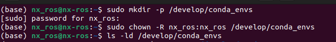
将 /develop/conda\_envs 添加到 conda 的环境目录列表首位（优先级最高）：
-------------------------------------------------------------------
\# 添加新路径到 conda 配置（prepend 表示加到列表最前面）\
conda config \--prepend envs\_dirs /develop/conda\_envs\
\
\# 验证配置是否生效（输出中第一个路径应为 /develop/conda\_envs）\
conda config \--show envs\_dirs
-------------------------------------------------------------------
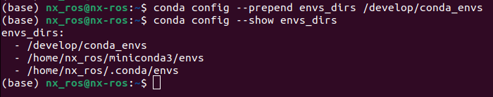
这样就可以放心安装conda环境了。
```