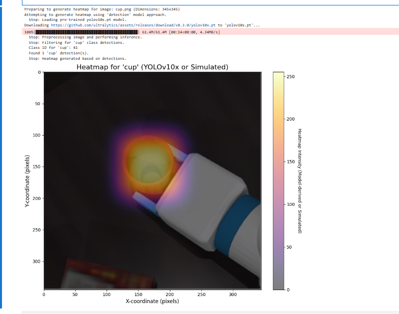

### 第一部分：注意力热图 (Attention Heatmap) 的原理

我们之前用YOLO生成的“热力图”其实是一种“**检测置信度图**”，它显示了模型在哪些区域检测到了物体及其置信度。而现在问的“注意力热图”，在学术上通常指**类激活图 (Class Activation Mapping, CAM)** 或其改进版 **Grad-CAM**，它揭示的是一个更深层次的问题：**为了做出某个特定的分类决策，模型的“注意力”集中在图像的哪个区域？**

这是一种强大的模型可解释性（XAI）技术，让我们能“看透”神经网络的“思考过程”。

#### 1. 核心思想：模型在“看”哪里？

想象一下，看一张图片并判断“这是一只猫”。大脑会不自觉地将注意力集中在猫的耳朵、胡须、眼睛和爪子等关键特征上。注意力热图就是试图可视化神经网络在做同样事情时的“视线焦点”。

#### 2. 工作原理 (以Grad-CAM为例，它更通用)

要理解其原理，我们需要简单回顾一下卷积神经网络（CNN）的结构：

- **卷积层 (Convolutional Layers)**：网络的前半部分由多个卷积层组成，它们负责从图像中提取特征，从低级的边缘、颜色，到高级的轮廓、部件（如眼睛、轮子）。越靠后的卷积层，提取的特征越抽象、越高级。

- **特征图 (Feature Maps)**：每个卷积层的输出就是一组“特征图”。你可以把每个特征图想象成一个专门寻找特定特征的“探测器”。例如，一个特征图可能在图像中所有“圆形”区域被激活，另一个可能在所有“尖锐耳朵”区域被激活。

- **最终决策**：网络最后，模型会综合所有这些高级特征图的信息，来做出最终的分类判断（例如，“这张图是'杯子'的概率是98%”）。

**Grad-CAM 的“魔法”就在于，它能计算出哪些特征图对于最终的“杯子”这个决策贡献最大。**

它的步骤可以简化为：

1. **选择目标层**：通常选择最后一个卷积层，因为它包含了最丰富的、用于决策的高级语义信息。

2. **计算梯度**：模型进行一次正向传播，得到“杯子”这个类别的预测分数。然后，它计算这个分数相对于我们选定的目标层中每个像素的**梯度**。这个梯度直观地表示了：“**如果我稍微改变这个像素的值，‘杯子’的预测分数会改变多少？**” 梯度越大的地方，说明该像素对最终决策越重要。

3. **计算权重**：对每个特征图的梯度求平均值，得到这个特征图对于“杯子”决策的“重要性权重”。

4. **生成热图**：将所有特征图按照它们各自的“重要性权重”进行加权求和。重要的特征图（比如“杯柄探测器”、“圆形杯口探测器”）会有更高的权重，不相关的特征图权重则很低。最终叠加起来，就会在原始图像中与杯子相关的区域形成高亮，这就是注意力热图。

**总结**：注意力热图（Grad-CAM）通过分析梯度，找出对最终分类结果贡献最大的特征区域，并将它们可视化，从而揭示了模型的“注意力焦点”。

---

### 第二部分：YOLOv10 的原理

YOLOv10 的核心目标是**在保持高精度的同时，实现极致的端到端实时性能**。它的主要创新点在于解决了传统YOLO模型依赖的一个关键瓶颈：**NMS (Non-Maximum Suppression, 非极大值抑制)**。

#### 1. 痛点：为什么NMS是个问题？

在之前的YOLO版本中，模型在推理时会生成大量重叠的边界框。NMS是一个后处理步骤，它的任务是：

- 查看所有针对同一个物体的、高度重叠的检测框。

- 只保留其中置信度最高的一个，删除其他的。

这个过程虽然有效，但有两大缺点：

- **计算开销**：NMS本身需要计算，增加了推理的延迟。

- **无法端到端**：它是一个独立的后处理模块，使得整个检测流程不是一个“端到端”（从输入到输出一步到位）的系统，难以部署和优化。

#### 2. YOLOv10 的核心创新：告别NMS

YOLOv10通过**一致性双重分配 (Consistent Dual Assignments)** 策略，在训练阶段就教会模型自己抑制冗余的检测框，从而在推理时不再需要NMS。

- **双重分配**：在训练时，对于一个真实物体，传统的YOLO通常只分配一个或少数几个正样本（预测框）。YOLOv10则同时采用两种分配策略：
  
  - **一对一匹配 (One-to-One Matching)**：强制要求一个分支只为每个物体生成一个最佳的、高质量的预测框。这个分支的目标是追求最高的检测精度。
  
  - **一对多匹配 (One-to-Many Matching)**：允许另一个分支像传统YOLO一样，为每个物体生成多个预测框，提供更丰富的监督信号，帮助模型更快收敛。

- **一致性监督**：模型被训练来确保“一对一”分支产生的那个最佳预测框，与“一对多”分支中分数最高的那个预测框尽可能一致。

通过这种方式，模型在训练中就学会了如何自主地选出那个“最佳代表”，并在推理时只输出那个高质量的框，自然就不再需要NMS来做筛选了。

#### 3. 其他关键设计

除了NMS-free，YOLOv10还进行了一系列“从整体出发的效率-精度驱动设计”：

- **轻量级分类头 (Lightweight Classification Head)**：发现在检测任务中，分类的难度远小于定位，因此大幅简化了分类头的结构，减少了计算量。

- **空间-通道解耦降采样 (Spatial-Channel Decoupled Downsampling)**：在降低特征图分辨率（空间）和变换特征数量（通道）时，将两者分开处理，能更有效地保留信息。

- **大核卷积 (Large-Kernel Convolutions)**：在网络的深层部分采用更大的卷积核，能有效扩大感受野，提升模型性能，同时在现代计算设备上增加的开销很小。

**总结**：YOLOv10通过创新的NMS-free训练策略和一系列精巧的结构优化，实现了在同等精度下比YOLOv8/v9更低延迟的端到端实时目标检测。

---

好的，我们继续完成这个YOLO版本的比较。

---

### 第三部分：不同YOLO版本的比较

YOLO系列的发展史就是一部追求更快、更强、更易用的目标检测进化史。

| 版本 (Version)            | 发布年份 (Approx. Year) | 核心思想 / 主要贡献              | 特点总结                                                                                                                                                      |
| ----------------------- | ------------------- | ------------------------ | --------------------------------------------------------------------------------------------------------------------------------------------------------- |
| **YOLOv1 - v3**         | 2015 - 2018         | **奠基时代：开创单阶段检测**         | **v1**: 将检测视为回归问题，速度极快但精度一般。**v2**: 引入Anchor Box，精度和召回率大幅提升。**v3**: 引入多尺度预测和更强的骨干网络Darknet-53，成为一代经典。                                                     |
| **YOLOv4 / v5**         | 2020                | **优化与工程化时代**             | **v4**: 提出“Bag of Freebies”和“Bag of Specials”，系统性地集成了当时几乎所有最有效的trick，是“集大成者”。**v5**: 由Ultralytics团队推出，基于PyTorch，极其注重工程实践、易用性和部署，提供了从n到x的全系列模型，成为应用最广泛的版本。 |
| **YOLOv6 / v7 / YOLOX** | 2021 - 2022         | **无锚框 (Anchor-Free) 时代** | 这些模型开始探索并转向无锚框设计，简化了训练流程。**YOLOX**: 引入SimOTA动态标签分配策略。**YOLOv6**: 引入更高效的RepVGG结构。**YOLOv7**: 提出扩展的高效层聚合网络（E-ELAN），在精度和速度上取得卓越平衡。                           |
| **YOLOv8**              | 2023                | **新基准与全面统一**             | 由Ultralytics在v5成功的基础上全面重构，成为新的行业基准。同样采用无锚框设计，并引入了新的C2f模块，进一步提升了性能。最重要的是，它将检测、分割、姿态估计等多种任务统一到一个框架下，极其灵活和强大。                                                |
| **YOLOv9**              | 2024                | **信息瓶颈与梯度优化**            | 针对深度网络中信息丢失的问题，提出了全新的概念。**核心贡献**: 引入可编程梯度信息（PGI）和通用高效层聚合网络（GELAN）。PGI旨在解决信息在深层网络中传递时被稀释的问题，让模型能学到更完整的特征。                                                  |
| **YOLOv10**             | 2024                | **无NMS的端到端时代**           | 实现了真正的端到端实时目标检测，其核心是去除了长期以来依赖的NMS后处理环节。**核心贡献**: 通过在训练中采用“一致性双重分配”策略，使模型自身具备了抑制冗余框的能力，从而在推理时无需NMS，显著降低了延迟。                                                |

```
%pip install ultralytics opencv-python
```

```python
import matplotlib.pyplot as plt
import numpy as np
from PIL import Image, ImageDraw # 用于图像处理和在占位符上绘制文本
import matplotlib.colors
import cv2 # OpenCV 用于高斯模糊

# 尝试导入YOLO模型库
try:
    from ultralytics import YOLO
    YOLO_AVAILABLE = True
except ImportError:
    print("Warning: 'ultralytics' library not found. YOLO model functionality will be unavailable, falling back to simulated heatmap.")
    print("Please install the required libraries with 'pip install ultralytics opencv-python'.")
    YOLO_AVAILABLE = False

# --- 辅助函数：生成模拟热力图 (用作占位符或回退) ---
def generate_simulated_heatmap(image_width, image_height, object_center_x, object_center_y, object_width, object_height, max_intensity=255, falloff_rate=0.0005):
    """
    Generates a simulated heatmap for an object.
    Intensity is highest at the object's center and falls off.
    This function serves as a placeholder for actual model output or as a fallback.
    """
    y, x = np.ogrid[:image_height, :image_width]
    std_x = object_width / 2
    std_y = object_height / 2
    std_x = max(std_x, 1) # Avoid division by zero
    std_y = max(std_y, 1) # Avoid division by zero

    dist_sq = (((x - object_center_x)**2) / (2 * std_x**2)) + \
              (((y - object_center_y)**2) / (2 * std_y**2))
    heatmap = max_intensity * np.exp(-dist_sq * falloff_rate * 10)
    return np.clip(heatmap, 0, max_intensity)

# --- 函数：从真实模型获取热力图 ---
def get_heatmap_from_actual_model(image_np, model_type='detection', object_class_name='cup'):
    """
    Attempts to get a heatmap from a real model.
    Uses YOLOv10x if available for object detection and heatmap generation.
    Otherwise, falls back to a simulated heatmap.

    Args:
        image_np (numpy.ndarray): Input image as a NumPy array (H, W, C).
        model_type (str): Currently only 'detection' is supported.
        object_class_name (str): Target class name for detection (e.g., 'cup').

    Returns:
        numpy.ndarray: Generated heatmap (2D array).
    """
    print(f"Attempting to generate heatmap using '{model_type}' model approach.")
    image_height, image_width = image_np.shape[:2]

    if model_type == 'detection' and YOLO_AVAILABLE:
        try:
            model_name = 'yolov10x.pt' # 尝试YOLOv10x, 这是YOLOv10系列中较大的模型
            # model_name = 'yolov9c.pt' # 可以改回YOLOv9c或其他模型进行测试
            # model_name = 'yolov8s.pt'
            print(f"  Step: Loading pre-trained {model_name} model.")
            model = YOLO(model_name)
            print("  Step: Preprocessing image and performing inference.")
            # 可以调整推理参数，例如置信度阈值 conf
            results = model(image_np, verbose=False, conf=0.25) # verbose=False, 增加conf参数示例

            heatmap = np.zeros((image_height, image_width), dtype=np.float32)
            detections_found = 0

            print(f"  Step: Filtering for '{object_class_name}' class detections.")
            target_cls_id = -1
            if hasattr(model, 'names') and isinstance(model.names, dict):
                for cls_id, name_val in model.names.items(): # Renamed 'name' to 'name_val' to avoid conflict
                    if name_val == object_class_name:
                        target_cls_id = cls_id
                        break
            else:
                print(f"  Warning: Model class names (model.names) not available in the expected format. Cannot map '{object_class_name}' to class ID.")


            if target_cls_id == -1:
                print(f"  Warning: Class '{object_class_name}' not found in model's classes or model.names not accessible. Will display an empty heatmap.")
            else:
                print(f"  Class ID for '{object_class_name}': {target_cls_id}")

                for result in results:
                    for box in result.boxes:
                        cls = int(box.cls)
                        conf = float(box.conf)
                        if cls == target_cls_id:
                            detections_found += 1
                            x1, y1, x2, y2 = map(int, box.xyxy[0])
                            # 使用置信度作为热度值填充矩形
                            cv2.rectangle(heatmap, (x1, y1), (x2, y2), conf, thickness=cv2.FILLED)

                if detections_found > 0:
                    print(f"  Found {detections_found} '{object_class_name}' detection(s).")
                    # 调整高斯模糊的核大小，可以根据效果调整
                    # 较大的核会产生更模糊（弥散）的热力图
                    blur_kernel_size = (101, 101) # 可以尝试减小如 (51,51) 或增大
                    heatmap = cv2.GaussianBlur(heatmap, blur_kernel_size, 0)
                    if heatmap.max() > 0:
                        heatmap = (heatmap / heatmap.max()) * 255 # 归一化到0-255
                    print("  Step: Heatmap generated based on detections.")
                    return heatmap.astype(np.uint8)
                else:
                    print(f"  No '{object_class_name}' detections found with current settings. Will display an empty heatmap.")
                    return heatmap # Return empty heatmap

        except Exception as e:
            print(f"  Error during YOLO model operation: {e}")
            print("  Fallback: Using simulated heatmap.")
            # Fallthrough to simulated heatmap generation

    # ----- Fallback to simulated heatmap if model is unavailable or an error occurs -----
    print("  Fallback: Using simulated heatmap as a placeholder.")
    center_x_ratio = 0.47
    center_y_ratio = 0.45
    width_ratio = 0.20
    height_ratio = 0.30

    obj_center_x_abs = int(center_x_ratio * image_width)
    obj_center_y_abs = int(center_y_ratio * image_height)
    obj_width_abs = int(width_ratio * image_width)
    obj_height_abs = int(height_ratio * image_height)

    simulated_heatmap = generate_simulated_heatmap(
        image_width, image_height,
        obj_center_x_abs, obj_center_y_abs,
        obj_width_abs, obj_height_abs
    )
    return simulated_heatmap

def plot_image_with_heatmap(image_path, heatmap_data, title="Object Detection Heatmap", alpha=0.6, cmap_name='inferno'):
    """
    Overlays a heatmap on an image and displays it. All plot text is in English.
    """
    try:
        img = Image.open(image_path).convert('RGB')
    except FileNotFoundError:
        print(f"Error: Image file not found at {image_path}.")
        img = Image.new('RGB', (500, 500), color = (128, 128, 128))
        draw = ImageDraw.Draw(img)
        draw.text((50, 230), "Image not found.\nPlease use a valid path.", fill=(255,0,0))
        heatmap_data = np.zeros((500, 500))
        print("Displaying placeholder image and empty heatmap.")

    img_np = np.array(img)

    fig, ax = plt.subplots(1, 1, figsize=(10, 8))
    ax.imshow(img_np)

    if heatmap_data.max() > 0:
        if heatmap_data.shape[0] != img_np.shape[0] or heatmap_data.shape[1] != img_np.shape[1]:
            print(f"Warning: Heatmap dimensions ({heatmap_data.shape}) differ from image dimensions ({img_np.shape[:2]}). Resizing heatmap.")
            heatmap_pil = Image.fromarray(heatmap_data.astype(np.uint8))
            heatmap_resized_pil = heatmap_pil.resize((img_np.shape[1], img_np.shape[0]), Image.BICUBIC)
            heatmap_data_resized = np.array(heatmap_resized_pil)
            cax = ax.imshow(heatmap_data_resized, cmap=plt.get_cmap(cmap_name), alpha=alpha, extent=(0, img_np.shape[1], img_np.shape[0], 0))
        else:
            cax = ax.imshow(heatmap_data, cmap=plt.get_cmap(cmap_name), alpha=alpha, extent=(0, img_np.shape[1], img_np.shape[0], 0))

        cbar = fig.colorbar(cax, ax=ax, orientation='vertical', fraction=0.046, pad=0.04)
        cbar.set_label('Heatmap Intensity (Model-derived or Simulated)', rotation=270, labelpad=15)
    else:
        print("Heatmap is empty (no detections or model not run), not overlaying.")

    ax.set_title(title, fontsize=16)
    ax.set_xlabel("X-coordinate (pixels)", fontsize=12)
    ax.set_ylabel("Y-coordinate (pixels)", fontsize=12)
    ax.axis('on')
    plt.tight_layout()
    plt.show()

if __name__ == '__main__':
    # --- Configuration ---
    image_file_path = 'cup.png' # 默认使用提到识别有困难的俯视图图像
    # image_file_path = 'image_2d8ceb.png' # 之前可以识别的图像
    # image_file_path = 'image_2d208d.jpg' # 另一张测试图像

    target_object_name = 'cup'

    # --- 加载图像 ---
    try:
        img_for_model = Image.open(image_file_path).convert('RGB')
        img_np_for_model = np.array(img_for_model)
        img_height, img_width = img_np_for_model.shape[:2]
        print(f"Preparing to generate heatmap for image: {image_file_path} (Dimensions: {img_width}x{img_height})")
    except FileNotFoundError:
        print(f"Fatal Error: Image file '{image_file_path}' not found. Cannot proceed.")
        img_np_for_model = np.zeros((500, 500, 3), dtype=np.uint8)
        img_width, img_height = 500, 500


    # --- Generate Heatmap ---
    heatmap_output = get_heatmap_from_actual_model(
        img_np_for_model,
        model_type='detection',
        object_class_name=target_object_name
    )

    # --- Plot Image with Heatmap ---
    plot_title = f"Heatmap for '{target_object_name}' (YOLOv10x or Simulated)"
    plot_image_with_heatmap(
        image_path=image_file_path,
        heatmap_data=heatmap_output,
        title=plot_title,
        alpha=0.5,
        cmap_name='inferno'
    )

    if not YOLO_AVAILABLE:
        print("\nReminder: To use the actual YOLO model for heatmap generation, ensure 'ultralytics' and 'opencv-python' are installed.")
        print("You can install them via 'pip install ultralytics opencv-python'.")
        print("Currently displaying a simulated heatmap.")
```


