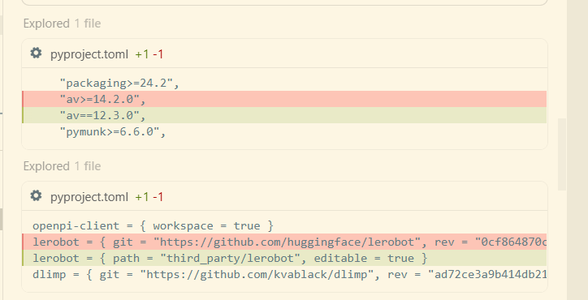
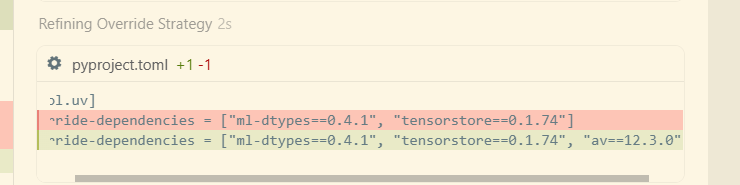

```
(isaac) root@gpufree-container:~/gpufree-data/openpi# uv sync
warning: The `tool.uv.dev-dependencies` field (used in `packages/openpi-client/pyproject.toml`) is deprecated and will be removed in a future release; use `dependency-groups.dev` instead
Resolved 281 packages in 1m 04s
    Updated https://github.com/huggingface/lerobot (0cf8
      Built openpi-client @ file:///root/gpufree-data/op
      Built openpi @ file:///root/gpufree-data/openpi
      Built lerobot @ git+https://github.com/huggingface
      Built tree==0.2.4
      Built antlr4-python3-runtime==4.9.3
      Built evdev==1.9.2
  × Failed to build `av==14.4.0`
  ├─▶ The build backend returned an error
  ╰─▶ Call to
      `setuptools.build_meta:__legacy__.build_wheel`
      failed (exit status: 1)

      [stdout]

      Warning! You are installing from source.
      It is EXPECTED that it will fail. You are
      REQUIRED to use ffmpeg 7.
      You MUST have Cython, pkg-config, and a C
      compiler.

      pkg-config could not find libraries ['avformat',
      'avcodec', 'avdevice', 'avutil', 'avfilter',
      'swscale', 'swresample']

      [stderr]
      Package libavformat was not found in the
      pkg-config search path.
      Perhaps you should add the directory containing
      `libavformat.pc'
      to the PKG_CONFIG_PATH environment variable
      No package 'libavformat' found
      Package libavcodec was not found in the
      pkg-config search path.
      Perhaps you should add the directory containing
      `libavcodec.pc'
      to the PKG_CONFIG_PATH environment variable
      No package 'libavcodec' found
      Package libavdevice was not found in the
      pkg-config search path.
      Perhaps you should add the directory containing
      `libavdevice.pc'
      to the PKG_CONFIG_PATH environment variable
      No package 'libavdevice' found
      Package libavutil was not found in the
      pkg-config search path.
      Perhaps you should add the directory containing
      `libavutil.pc'
      to the PKG_CONFIG_PATH environment variable
      No package 'libavutil' found
      Package libavfilter was not found in the
      pkg-config search path.
      Perhaps you should add the directory containing
      `libavfilter.pc'
      to the PKG_CONFIG_PATH environment variable
      No package 'libavfilter' found
      Package libswscale was not found in the
      pkg-config search path.
      Perhaps you should add the directory containing
      `libswscale.pc'
      to the PKG_CONFIG_PATH environment variable
      No package 'libswscale' found
      Package libswresample was not found in the
      pkg-config search path.
      Perhaps you should add the directory containing
      `libswresample.pc'
      to the PKG_CONFIG_PATH environment variable
      No package 'libswresample' found

      hint: This usually indicates a problem with the
      package or the build environment.
  help: `av` (v14.4.0) was included because `openpi`
        (v0.1.0) depends on `lerobot` (v0.1.0) which
        depends on `av`
```


```bash
mkdir -p /root/gpufree-data/openpi/third_party && git clone https://github.com/huggingface/lerobot /root/gpufree-data/openpi/third_party/lerobot && cd /root/gpufree-data/openpi/third_party/lerobot && git checkout 0cf864870cf29f4738d3ade893e6fd13fbd7cdb5


```






1.  **克隆并修改 LeRobot**：在 `third_party/lerobot` 目录下克隆了指定版本的 LeRobot，并将其 `pyproject.toml` 中的 `av>=14.2.0` 修改为更具兼容性的 `av==12.3.0`（这个版本通常有预编译的 wheel，不需要 FFmpeg 7）。
2.  **配置本地依赖**：修改了 `openpi/pyproject.toml`，将 `lerobot` 的来源从远程仓库改为本地路径，并添加了 `av==12.3.0` 的强制覆盖（override）。
3.  **成功同步环境**：执行 `uv sync` 已成功安装所有依赖，没有再出现 `av` 编译失败的问题。

### 现在的状态
环境已经就绪。关于您提到的命令，有一个小细节：命令末尾的 `@gpufree-data/openpi` 看起来是 shell 提示符（Prompt）被误粘进来了，**实际运行命令时需要去掉它**。

**建议运行的完整命令：**

```bash
XLA_PYTHON_CLIENT_MEM_FRACTION=0.5 uv run scripts/serve_policy.py policy:checkpoint \
    --policy.config=pi0_fast_droid_jointpos_polaris \
    --policy.dir=gs://openpi-assets/checkpoints/pi0_fast_droid_jointpos
```

### 执行后会发生什么？
1.  **加载配置**：使用 `pi0_fast_droid_jointpos_polaris` 配置，这是针对 DROID 机械臂联合位置控制的 π₀-FAST 模型。
2.  **下载模型**：`uv` 会自动从 Google Cloud 存储下载模型参数和资源，并缓存到 `~/.cache/openpi/openpi-assets/checkpoints/pi0_fast_droid_jointpos`。
3.  **启动服务**：在本地启动一个 WebSocket 推理服务器（默认 8000 端口）。
4.  **显存控制**：`XLA_PYTHON_CLIENT_MEM_FRACTION=0.5` 会确保 JAX 预分配显存不超过 50%，为 Isaac Sim 留出足够的空间。

**注意**：`uv` 依然是在它自己创建的 `.venv` 虚拟环境中运行，**完全不会破坏或修改您的 `isaac` conda 环境**。