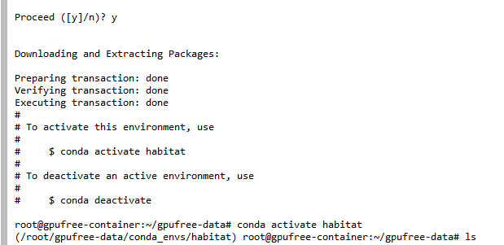
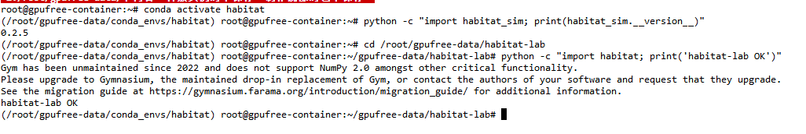
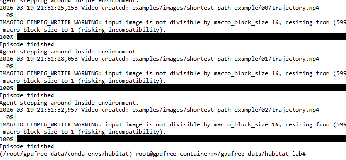
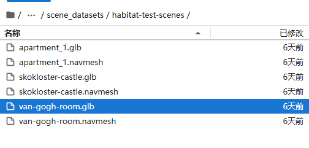
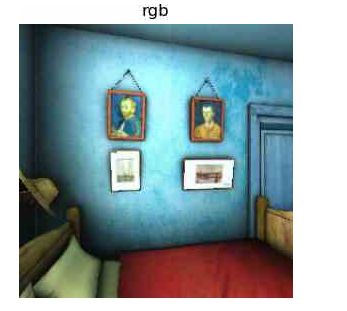
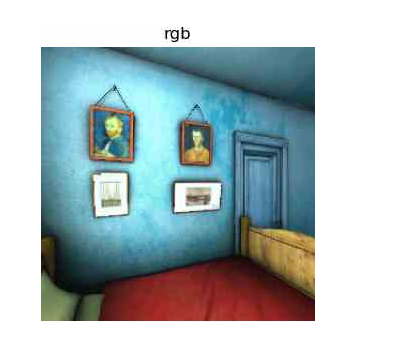
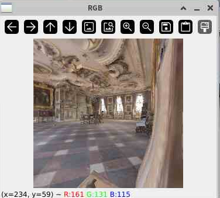
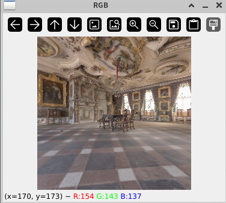
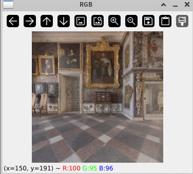

# Habitat 仿真平台完整入门笔记

> 从零开始！小白也能学会的 Habitat 导航实战指南
> 
> 本文为【Datawhale-具身智能零基础】学习笔记
> 
> 参考链接：https://github.com/datawhalechina/every-embodied/tree/main/08-%E5%85%B7%E8%BA%AB%E5%AF%BC%E8%88%AA%E5%8F%8AVLN

---

## 完整学习路径

```
1：环境搭建
├── 安装 habitat-sim + habitat-lab 
├── 下载测试场景
└── 运行 habitat_test.py 

2：基础操作
├── 运行 habitatlab_test.py（手动控制）
└── 运行 habitatlab_example.py（自动导航）

3：进阶理解（本节重点）
├── 运行 habitat_rl.py 
├── 理解 RLEnv vs Env
└── 理解为什么需要 RL 框架

4：VLN 入门
├── 学习 PointNav → VLN 递进
├── 理解视觉语言对齐
└── 阅读 VLN-CE 论文
```

---

# Habitat 是什么？

**Habitat** 是 Meta AI 开源的具身智能仿真平台，专为室内场景下的智能体导航、交互、决策等研究设计。

想象一下，你有一个**虚拟的机器人**，你想训练它在**虚拟房子里找到路**。

**Habitat** 就是这样一个**训练场**：

| 组成部分 | 作用 | 类比 |
|----------|------|------|
| **Habitat-Sim** | 3D 仿真引擎 | 游戏引擎（渲染画面、物理碰撞） |
| **Habitat-Lab** | 任务框架 | 游戏规则（怎么算赢、怎么算输） |
| **3D 场景数据** | 虚拟房间 | 游戏的地图 |

> 🧁 你能用它做什么？
> - 训练机器人自主导航
> - 测试寻路算法
> - 研究视觉语言导航（VLN）

| 任务类型 | 描述 |
|----------|------|
| **PointNav** | 点目标导航（给定坐标） |
| **ObjectNav** | 物体目标导航（找到指定物体） |
| **VLN** | 视觉语言导航（跟随指令） |
| **Rearrange** | 物体重排/拾取放置 |

## 核心组成

```
┌─────────────────────────────────────────────────────────────┐
│                    Habitat-Lab (算法层)                      │
│  • 任务定义：PointNav、ObjectNav、VLN、Rearrange           │
│  • 评估指标：成功率(SR)、路径效率(SPL)、距离等              │
│  • 封装了标准化的 Python API                                │
└─────────────────────────────────────────────────────────────┘
                              │
                              ▼  (通过配置调用)
┌─────────────────────────────────────────────────────────────┐
│                   Habitat-Sim (仿真引擎)                     │
│  • 渲染：RGB、深度图、语义分割                               │
│  • 物理：刚体碰撞、关节运动                                  │
│  • 传感器：相机、LiDAR、IMU                                  │
│  • GPU 并行加速，单卡可运行数千环境                          │
└─────────────────────────────────────────────────────────────┘
                              │
                              ▼
┌─────────────────────────────────────────────────────────────┐
│                   3D 场景数据集                               │
│  • HM3D (Matterport3D) - 需授权                              │
│  • Gibson - 需授权                                           │
│  • Replica - 高精度重建                                      │
│  • habitat-test-scenes - 免费测试用                          │
└─────────────────────────────────────────────────────────────┘
```

---

# 环境安装

```bash
# 配置全局代理
git config --global url."https://gh-proxy.org/https://github.com/".insteadOf "https://github.com/"
```

## Habitat-lab环境搭建

conda创建habitat环境

```bash
conda create -n habitat python=3.9 cmake=3.14.0
conda activate habitat
```



- 如果下载时conda环境下载慢，可以考虑换源下载

```bash
conda config --add channels https://mirror.nju.edu.cn/anaconda/pkgs/main
conda config --add channels https://mirror.nju.edu.cn/anaconda/pkgs/free
conda config --add channels https://mirror.nju.edu.cn/anaconda/cloud/conda-forge
```

在下载habitat-lab的时候注意需要与安装的habitat-sim版本一致，例如本教程使用的 **habitat-sim版本是0.2.5**，则需要下载 **0.2.5版本的habitat-lab**，复现其他论文的时候也要注意habitat-sim和habitat-lab版本一致。

要准备下载工程了，使用git代理

```bash
git config --global url."https://gh-proxy.org/https://github.com/".insteadOf "https://github.com/"
```

下载 **habitat-lab**

```bash
git clone --branch v0.2.5 https://github.com/facebookresearch/habitat-lab.git
cd habitat-lab
pip install -e habitat-lab
```

同时安装habitat-baselines

```bash
pip install -e habitat-baselines
```

## Habitat-sim环境搭建

> ⚠️ 建议安装Bullet 引擎版本

```bash
# 需要在 habitat 环境中，若不在则运行conda activate habitat
# 安装 habitat-sim（headless 无物理模拟版本）
conda install habitat-sim=0.2.5 headless -c conda-forge -c aihabitat

# 如果需要物理模拟（Bullet 引擎）
conda install habitat-sim=0.2.5 withbullet headless -c conda-forge -c aihabitat
```

检查现有环境，是否已经有 Python 3.9 的 `habitat` 环境：

```bash
# 需要在 habitat 环境中，若不在则运行conda activate habitat
python --version 
```

## 数据集下载

### 3D场景数据和点导航数据

下载3D场景数据和点导航数据，数据放置位置为 `gpufree-data/habitat-lab/data/`（云服务器），如果 HuggingFace 可访问：

```bash
cd habitat_lab
# 方法一，通过 HuggingFace下载
python -m habitat_sim.utils.datasets_download --uids habitat_test_scenes --data-path data/
python -m habitat_sim.utils.datasets_download --uids habitat_test_pointnav_dataset --data-path data/
# 备选
python -m habitat_sim.utils.datasets_download --uids habitat_example_objects --data-path data/
```

如果 **HuggingFace可能访问**（被屏蔽），可以使用了 Facebook 公开 CDN：

```bash
conda activate habitat

# 方法二，直接用 wget 下载 
cd /root/gpufree-data/
wget https://dl.fbaipublicfiles.com/habitat/habitat-test-scenes.zip

# 解压到数据目录
unzip habitat-test-scenes.zip -d data/scene_datasets/

# 重命名（如果需要）
mv data/habitat-test-scenes/* data/scene_datasets/habitat-test-scenes/

wget -c http://dl.fbaipublicfiles.com/habitat/mp3d_example.zip
unzip -o mp3d_example.zip -d data/scene_datasets/
```

### HM3D 数据集

#### 什么是HM3D数据集

HM3D（Habitat-Matterport 3D）是 **Habitat 官方推荐的数据集**，由 Matterport3D 扫描的室内场景构成。

| 特性 | 说明 |
|------|------|
| **规模** | 800+ 室内场景 |
| **用途** | 训练、验证、测试具身智能导航算法 |
| **质量** | 高保真 3D 重建，包含几何和语义信息 |
| **授权** | 需要 Matterport 开发者账号 |

#### HM3D 是否必要？

| 场景 | 是否必要 | 说明 |
|------|----------|------|
| 学习/入门 | ❌ 不必要 | 免费测试场景足够练习基本操作 |
| 论文复现 | ✅ 必要 | 大多数 VLN/Nav 论文使用 HM3D 训练集 |
| 算法训练 | ✅ 必要 | 需要大量场景才能训练出可泛化的模型 |
| 简单 Demo | ❌ 不必要 | test-scenes 足够演示 |

> **结论**：学习阶段用免费测试场景即可，后续论文复现或训练时再申请 HM3D。

#### HM3D 下载步骤

1. **注册 Matterport 账号**
   - 访问：https://my.matterport.com/settings/account/devtools
   - 需要邮箱验证

2. **获取 API Token**
   - 登录后进入 Developer Tools → API Token Management
   - 创建新 Token（记录 ID 和 Secret）

3. **下载数据集**

```bash
conda activate habitat

# 查看可用数据集
python -m habitat_sim.utils.datasets_download --help

# 下载验证集（最小版本）
python -m habitat_sim.utils.datasets_download \
    --username <your_api_token_id> \
    --password <your_api_token_secret> \
    --uids hm3d_minival_v0.2 \
    --data-path data/

# 下载完整训练集（较大，约 15GB）
python -m habitat_sim.utils.datasets_download \
    --username <your_api_token_id> \
    --password <your_api_token_secret> \
    --uids hm3d_train_habitat_v0.2 \
    --data-path data/
```

#### HM3D 版本说明

| 版本 | 说明 |
|------|------|
| `hm3d_train_habitat_v0.2` | 训练集（最大） |
| `hm3d_val_habitat_v0.2` | 验证集 |
| `hm3d_minival_habitat_v0.2` | 小验证集（快速测试用） |
| `hm3d_val` | 完整验证集 |

---

# 运行 Demo

## 验证安装

```bash
# 需要在 habitat 环境中，若不在则运行conda activate habitat

# 检查 habitat-sim 是否安装成功
python -c "import habitat_sim; print(habitat_sim.__version__)"

# 检查 habitat-lab 是否安装成功
cd /root/gpufree-data/habitat-lab
python -c "import habitat; print('habitat-lab OK')"
```



## 运行最短路径导航 Demo

```bash
# 需要在 habitat 环境中，若不在则运行conda activate habitat
cd /root/gpufree-data/habitat-lab

# 运行 shortest_path_follower_example.py
python examples/shortest_path_follower_example.py
```



<video src="./videos/01-trajectory.mp4" controls="controls"></video>

<video src="./videos/02-trajectory.mp4" controls="controls"></video>

## 程序执行流程解析

以 `shortest_path_follower_example.py` 为例：

```
┌─────────────────────────────────────────────────────────────────┐
│                      1. 加载 YAML 配置                          │
│   • pointnav_habitat_test.yaml                                  │
│   • 定义任务、数据集、传感器、智能体参数                         │
└─────────────────────────────────────────────────────────────────┘
                              │
                              ▼
┌─────────────────────────────────────────────────────────────────┐
│                      2. 初始化环境                              │
│   • habitat.Env(config)                                         │
│   • 加载场景 → 创建智能体 → 初始化传感器                         │
└─────────────────────────────────────────────────────────────────┘
                              │
                              ▼
┌─────────────────────────────────────────────────────────────────┐
│                      3. 创建 Agent                              │
│   • ShortestPathFollowerAgent                                   │
│   • 内部使用 ShortestPathFollower 计算最短路径                   │
└─────────────────────────────────────────────────────────────────┘
                              │
                              ▼
┌─────────────────────────────────────────────────────────────────┐
│                      4. 导航循环                                │
│   while not episode_over:                                       │
│       obs = env.reset()                                         │
│       action = agent.act(obs)  # 获取下一步动作                   │
│       obs, reward, done, info = env.step(action)                │
│       # 生成可视化帧                                            │
└─────────────────────────────────────────────────────────────────┘
                              │
                              ▼
┌─────────────────────────────────────────────────────────────────┐
│                      5. 生成视频                                │
│   • 拼接 RGB 图像 + 俯视图 + 指标                              │
│   • 输出为 MP4 视频                                             │
└─────────────────────────────────────────────────────────────────┘
```

## 关键类说明

| 类名 | 作用 |
|------|------|
| `habitat.Env` | 统一环境接口，封装 Sim + Task |
| `habitat.RLEnv` | 强化学习环境封装，适配 gym 接口 |
| `ShortestPathFollower` | 基于几何的最短路径规划器 |
| `ShortestPathFollowerAgent` | Agent 接口实现，调用 ShortestPathFollower |
| `GreedyGeodesicFollower` | 贪婪跟随器，计算每一步最优动作 |

---

## YAML 配置核心字段

```yaml
habitat:
  # 数据集
  dataset:
    type: PointNav-v1        # 任务类型
    split: train              # train/val/test
    data_path: "data/datasets/pointnav/..."

  # 任务
  task:
    type: Nav-v0             # 导航任务
    reward_measure: distance_to_goal_reward
    success_measure: success
    success_distance: 0.2   # 成功阈值（米）

  # 环境
  environment:
    max_episode_steps: 500   # 最大步数

  # 仿真器
  simulator:
    scene: "data/scene_datasets/.../skokloster-castle.glb"
    forward_step_size: 0.25   # 前进步长（米）
    turn_angle: 10            # 旋转角度（度）

    # 智能体
    agents:
      main_agent:
        height: 1.5           # 智能体高度
        radius: 0.1           # 碰撞半径
        sim_sensors:
          rgb_sensor:
            width: 256
            height: 256
          depth_sensor:
            width: 256
            height: 256
```

---

# 运行code实例文件

> 课程示例文件位于：`/root/gpufree-data/every-embodied/08-具身导航及VLN/02仿真环境基础/habitat导航环境/code/`

## 文件清单与对应关系

| 课程章节 | 代码文件 | 作用 | 难度 |
|----------|----------|------|------|
| 基础测试 | `habitat_test.py` | 测试环境能否加载 | ⭐ |
| 手动控制 | `habitatlab_test.py` | 键盘控制智能体移动 | ⭐⭐ |
| Agent自动导航 | `habitatlab_example.py` | 全自动导航+生成视频 | ⭐⭐⭐ |
| RL框架导航 | `habitat_rl.py` | 适配强化学习接口 | ⭐⭐⭐⭐ |
| 随机导航 | `habitat_random.py` | 随机动作作为对比 | ⭐⭐ |
| 路径规划 | `habitat_pathfind.py` | 测试寻路算法 | ⭐⭐⭐ |
| 3D网格 | `habitat_mesh.py` | 处理场景数据 | ⭐⭐⭐ |

## 学习顺序（推荐）

```
habitat_test.py        → 先知道环境怎么加载
        ↓
habitatlab_test.py     → 亲手控制智能体移动
        ↓
habitatlab_example.py  → 让智能体自己跑
        ↓
habitat_rl.py          → 理解 RL 框架（为 VLN 打基础）
```

每个文件怎么运行？（详细步骤）首先需要复制代码到 habitat-lab

> ⚠️ **重要**：所有代码需要在 `habitat-lab` 目录下运行！

```bash
# 进入 habitat-lab 目录
cd /root/gpufree-data/habitat-lab

# 若没有下载课程代码需要先clone
git clone https://github.com/datawhalechina/every-embodied.git

# 复制课程代码
cp /root/gpufree-data/every-embodied/08-具身导航及VLN/02仿真环境基础/habitat导航环境/code/*.py examples/
```

---

## 第一个程序：habitat_test.py 🐣

> **目的**：测试环境能否正常加载（最基础的一步）

已下载的 habitat-test-scenes 场景中有多个场景，可以供我们简单了解，路径为 `gpufree-data/habitat-lab/data/habitat-test-scenes`



所以可以对habitat_test.py 进行修改，避免下载额外数据，原始代码使用 `mp3d_example` 场景，需要额外下载 ~100MB。我们已有 `habitat-test-scenes`（91MB），直接复用更方便

```python
# ========== 改前（第 65-68 行）==========
test_scene = "./data/scene_datasets/mp3d_example/17DRP5sb8fy/17DRP5sb8fy.glb"

# ========== 改后 ==========
# 使用已下载的 habitat-test-scenes 场景
test_scene = "examples/data/scene_datasets/habitat-test-scenes/van-gogh-room.glb"
```

**运行命令**：

```bash
# 需要在 habitat 环境中，若不在则运行conda activate habitat
cd /root/gpufree-data/habitat-lab
python examples/habitat_test.py
```

**程序做了什么？**：

```
1. 加载一个 3D 场景（虚拟房间）
2. 放置一个智能体（虚拟机器人）
3. 智能体执行几个简单动作：右转 → 右转 → 前进 → 左转
4. 每一步都保存图片
```

**输出**：





- 当前目录生成 `observation_0.png`、`observation_1.png`... 等图片
- 可以看到智能体视角的画面
- 就像打开游戏，按了几个键，看到画面变化了。🎮

---

## 第二个程序：habitatlab_test.py 🎮

> **目的**：用键盘手动控制智能体，亲身体验导航

下载PointNav任务配置

```bash
# 方法一
python -m habitat_sim.utils.datasets_download --uids habitat_test_pointnav_dataset --data-path data/

# 方法二
cd /root/gpufree-data/habitat-lab
wget https://dl.fbaipublicfiles.com/habitat/habitat-test-pointnav-dataset.zip
unzip -o habitat-test-pointnav-dataset.zip -d data/datasets/pointnav/
```

**运行命令**：

```bash
# 需要在 habitat 环境中，若不在则运行conda activate habitat
cd /root/gpufree-data/habitat-lab/examples
python habitatlab_test.py
```

**程序做了什么？**：

1. 加载 PointNav 任务配置（YAML）
2. 创建 habitat 环境
3. 进入循环，等待键盘输入
4. 根据输入执行动作（turn_left/turn_right/move_forward/stop）
5. 显示每一步的观测画面

**交互方式**：键盘进行控制"wasd"控制，相当于

- 输入 turn_left → 左转
- 输入 turn_right → 右转
- 输入 move_forward → 前进
- 输入 stop → 停止


然后在图像画面中，使用键盘进行控制"wasd"，







就像玩第一人称游戏，你自己控制角色走路。

---

## 第三个程序：habitatlab_example.py 🤖

> **目的**：让智能体全自动完成导航，不需要人工干预

**运行命令**：

```bash
# 需要在 habitat 环境中，若不在则运行conda activate habitat
cd /root/gpufree-data/habitat-lab
python examples/habitatlab_example.py
```

我们之前已成功运行shortest_path_follower_example.py，生成了 3 个视频，这次让智能体能循环执行。视频保存在：`examples/tutorials/habitat_lab_visualization/`

<video src="./videos/03-skokloster-castle-glb-3662.mp4" controls="controls"></video>

**程序做了什么？**

```
┌─────────────────────────────────────────────────────────────┐
│  habitatlab_example.py 的工作流程                           │
├─────────────────────────────────────────────────────────────┤
│  1. 加载 YAML 配置（任务、场景、传感器）                    │
│  2. 创建环境 env                                            │
│  3. 创建 ShortestPathFollowerAgent（智能体）                │
│     └── 内部使用 ShortestPathFollower（路径规划器）          │
│  4. 循环执行（最多 3 个 episode）：                         │
│     ├── env.reset() - 重置到起点                            │
│     ├── agent.act(obs) - 让 Agent 决定下一步做什么          │
│     ├── env.step(action) - 执行动作                         │
│     ├── 收集画面（RGB + 俯视图）                            │
│     └── 重复直到 episode 结束                               │
│  5. 生成视频保存到文件                                      │
└─────────────────────────────────────────────────────────────┘
```

**核心代码逻辑**：

```python
# 1. 定义 Agent 类
class ShortestPathFollowerAgent(Agent):
    def __init__(self, env, goal_radius):
        # 创建最短路径规划器
        self.shortest_path_follower = ShortestPathFollower(...)
    
    def act(self, observations):
        # 每次调用返回下一步动作
        goal_pos = self.env.current_episode.goals[0].position
        return self.shortest_path_follower.get_next_action(goal_pos)

# 2. 主循环
env = habitat.Env(config=config)
agent = ShortestPathFollowerAgent(env, goal_radius=0.5)

while not env.episode_over:
    obs = env.reset()
    action = agent.act(obs)  # ← 智能体自己决定！
    obs, reward, done, info = env.step(action)
```

**ShortestPathFollower 是什么？**

| 组件 | 作用 |
|------|------|
| `GreedyGeodesicFollower` | 基于几何的贪婪跟随器 |
| `get_next_action()` | 返回下一步最优动作 |

它就像GPS导航：

- 知道自己在哪（GPS定位）
- 知道目标在哪
- 算出最短路径
- 告诉你下一步往哪走

---

## 第四个程序：habitat_rl.py 🧠（本节重点！）

> **目的**：学习强化学习环境接口，为后续 VLN 打基础

**运行命令**：

```bash
# 需要在 habitat 环境中，若不在则运行conda activate habitat
cd /root/gpufree-data/habitat-lab
python examples/habitat_rl.py
```

**输出**：视频保存在：`examples/images/shortest_path_example/`

<video src="./videos/04-rl-trajectory.mp4" controls="controls"></video>

<video src="./videos/05-rl-trajectory-3.mp4" controls="controls"></video>

RLEnv 就是给环境加了"奖励机制"，做对了加分，做错了扣分。这样训练出的"智能" Agent 才能自己学习！

**程序做了什么？**

```
┌─────────────────────────────────────────────────────────────┐
│  habitat_rl.py         vs habitatlab_example.py 对比        │
├─────────────────────────────────────────────────────────────┤
│                                                             │
│  habitatlab_example.py          habitat_rl.py               │
│  ───────────────────          ──────────────                │
│  使用 habitat.Env               使用 habitat.RLEnv           │
│                                                             │
│  env.step(action) 返回:         env.step(action) 返回:       │
│    (observations, info)         (obs, reward, done, info)   │
│                                                             │
│   需要自己定义 Agent            可以自定义奖励函数             │
│                                                             │
└─────────────────────────────────────────────────────────────┘
```

**核心区别**：

| 特性 | `habitat.Env` | `habitat.RLEnv` |
|------|---------------|-----------------|
| 接口 | `env.step(action)` | `env.step(action)` |
| 返回 | `(obs, info)` | `(obs, reward, done, info)` |
| 适用场景 | 通用 | 强化学习训练 |
| 奖励函数 | 预定义 | 可自定义 |

**代码对比**：

```python
# ===== habitat.Env (habitatlab_example.py) =====
env = habitat.Env(config=config)
obs, info = env.step(action)

# ===== habitat.RLEnv (habitat_rl.py) =====
class SimpleRLEnv(habitat.RLEnv):
    def get_reward_range(self):
        return [-1, 1]  # 奖励范围
    
    def get_reward(self, observations):
        # 可以自定义奖励！
        return 0
    
    def get_done(self, observations):
        return self.habitat_env.episode_over
    
    def get_info(self, observations):
        return self.habitat_env.get_metrics()

env = SimpleRLEnv(config=config)
obs, reward, done, info = env.step(action)  # ← 多返回 reward
```

**为什么要用 RLEnv？**

VLN (视觉语言导航) 的本质 = 强化学习 + 视觉语言理解

所以要先学会 RLEnv，才能进阶到 VLN！

**程序完整流程**：

```python
# 1. 定义 RL 环境
class SimpleRLEnv(habitat.RLEnv):
    def get_reward_range(self):
        return [-1, 1]
    
    def get_reward(self, observations):
        return 0  # 可以设计复杂奖励：靠近目标+，撞到-
    
    def get_done(self, observations):
        return self.habitat_env.episode_over
    
    def get_info(self, observations):
        return self.habitat_env.get_metrics()

# 2. 创建环境
config = habitat.get_config(config_path="benchmark/nav/pointnav/pointnav_habitat_test.yaml")
env = SimpleRLEnv(config=config)

# 3. 创建路径规划器
follower = ShortestPathFollower(env.habitat_env.sim, goal_radius, False)

# 4. 导航循环
for episode in range(3):
    env.reset()
    while not env.habitat_env.episode_over:
        # 获取动作
        best_action = follower.get_next_action(goal_pos)
        # 执行（RL 风格：返回 reward）
        observations, reward, done, info = env.step(best_action)
    # 生成视频
    images_to_video(images, dirname, "trajectory")
```

## RLEnv 框架详解

**什么是 RLEnv？**

`habitat.RLEnv` 是强化学习环境的封装类，适配 gym 接口：

```python
import habitat

class SimpleRLEnv(habitat.RLEnv):
    """自定义 RL 环境"""
    
    def get_reward_range(self):
        """返回奖励范围 [min, max]"""
        return [-1, 1]
    
    def get_reward(self, observations):
        """
        计算奖励函数
        可以基于距离变化、是否成功等自定义
        """
        return 0  # 简化版本，返回 0
    
    def get_done(self, observations):
        """判断 episode 是否结束"""
        return self.habitat_env.episode_over
    
    def get_info(self, observations):
        """返回额外信息（如距离、成功率等）"""
        return self.habitat_env.get_metrics()
```

**RLEnv vs Env 对比**

| 特性 | `habitat.Env` | `habitat.RLEnv` |
|------|---------------|-----------------|
| 接口 | `env.step(action)` | `env.step(action)` |
| 返回 | `(obs, info)` | `(obs, reward, done, info)` |
| 适用场景 | 通用 | 强化学习训练 |
| 奖励函数 | 预定义 | 可自定义 |

**自定义奖励函数示例**

```python
def get_reward(self, observations):
    """基于距离变化设计奖励"""
    distance_now = self.habitat_env.get_metrics().get('distance_to_goal', 0)
    
    # 奖励 = 距离减少量
    reward = self._prev_distance - distance_now
    self._prev_distance = distance_now
    
    # 成功奖励
    if self.habitat_env.get_metrics().get('success', False):
        reward += 2.5
    
    return reward
```

---

## 学习目标与路径

| 本节学习 程序 | 学会目标 |
|--------------|----------|
| `habitat_test.py` | 环境加载 |
| `habitatlab_test.py` | 人机交互 |
| `habitatlab_example.py` | 自动导航 |
| `habitat_rl.py` | RL 接口 |

**为什么要学 habitat_rl.py？**

```
┌─────────────────────────────────────────────────────────────┐
│                    任务难度递进                              │
├─────────────────────────────────────────────────────────────┤
│                                                              │
│  PointNav (本节)         VLN (后续课程)                     │
│  ─────────────          ──────────────                     │
│  输入：坐标 [x,y,z]      输入：自然语言指令                  │
│         ↓                       ↓                           │
│  GPS 罗盘感知            RGB + 语言编码                      │
│         ↓                       ↓                           │
│  规则化奖励              学习奖励                            │
│         ↓                       ↓                           │
│  ─────────────          ──────────────                     │
│  本质：找路              本质：理解+找路                     │
│                                                              │
│  habitat_rl.py 是连接点！                                   │
└─────────────────────────────────────────────────────────────┘
```

**数据配置文件路径**

| 配置文件 | 位置 |
|----------|------|
| PointNav 基础 | `habitat-lab/habitat/config/benchmark/nav/pointnav/pointnav_base.yaml` |
| PointNav 测试 | `habitat-lab/habitat/config/benchmark/nav/pointnav/pointnav_habitat_test.yaml` |
| PPO 训练 | `habitat-baselines/habitat_baselines/config/pointnav/ppo_pointnav_example.yaml` |

**数据路径**：

- 场景数据：`/root/gpufree-data/data/scene_datasets/habitat-test-scenes/`
- habitat-lab：`/root/gpufree-data/habitat-lab/`
- 课程代码：`/root/gpufree-data/every-embodied/08-具身导航及VLN/02仿真环境基础/habitat导航环境/code/`

**参考文档**：
- 官方文档：https://github.com/facebookresearch/habitat-lab
- 课程文档：`/root/gpufree-data/every-embodied/08-具身导航及VLN/02仿真环境基础/habitat导航环境/`

---

## 附录：常见问题

**Q1：运行报错 "ModuleNotFoundError"**

```bash
# 确保在 habitat-lab 目录下
cd /root/gpufree-data/habitat-lab

# 确保 conda 环境已激活
conda activate habitat
```

**Q2：视频生成在哪里？**

具体看运行程序时的提示

```bash
# habitatlab_example.py
ls examples/tutorials/habitat_lab_visualization/

# habitat_rl.py  
ls examples/images/shortest_path_example/
```

**Q3：如何修改目标点？**

在代码中修改 goal_radius：

```python
follower = ShortestPathFollower(env.habitat_env.sim, goal_radius=0.5, ...)
# 0.5 米内算到达目标
```
